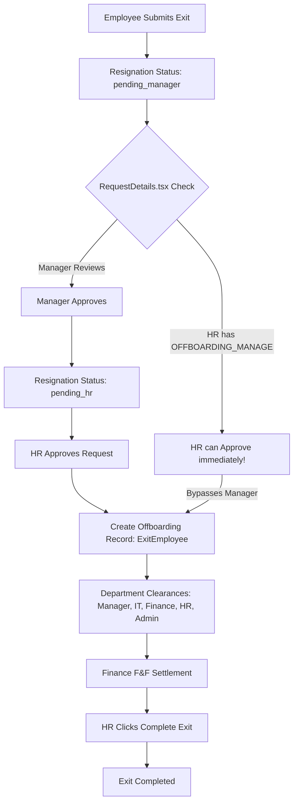
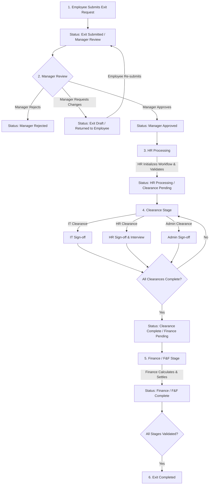

# NexusHR EMS — Offboarding & Exit Workflow Audit & Implementation Plan

**Document Version:** 1.0.0  
**Date:** August 25, 2026  
**Status:** Audit & Architecture Specification Complete (Task 6.1)  
**Target Repository:** d:\Employment Management System (NexusHR EMS)

---

## 1. Executive Summary

An audit of the NexusHR Employment Management System (EMS) Offboarding and Exit workflow was conducted to evaluate compliance with the authoritative business exit lifecycle. 

The audit identified critical architectural gaps in status transition mechanics, role authorization, screen routing, and approval boundaries. Most notably:
1. **HR Approval Bypass:** HR currently has direct approval authority (`status: "approved"`) over resignation requests, violating the canonical rule that **HR must NOT approve employee exits** and may only **process** an exit after Manager Approval.
2. **Missing Manager Review/Approval UI & Routing:** Managers do not have a dedicated Exit Review screen or navigation item within Manager Workspace; currently, resignation requests are only viewable within the HR Offboarding page (`/offboarding`).
3. **Incomplete Lifecycle Status Machine:** The current implementation uses ad-hoc status strings (`draft`, `pending_manager`, `pending_hr`, `approved`, `rejected`) rather than a full multi-stage state machine that encompasses Clearance and Finance/F&F stages.
4. **Missing Action Guards & Confirmation Dialogs:** Several state changes lack explicit, non-bypassable confirmation modals that explain consequential action outcomes.

This document presents the full architectural audit findings, gap analysis, target permission/action matrices, status model, security/isolation considerations, edge case handling, and a 4-phase implementation plan (Tasks 6.2 – 6.5).

---

## 2. Existing Offboarding Architecture

The existing Offboarding / Exit feature is distributed across five main areas in the codebase:

```
src/
├── app/
│   ├── features/
│   │   └── Offboarding/
│   │       ├── OffboardingPage.tsx           # Primary HR Offboarding dashboard
│   │       ├── components/
│   │       │   ├── RequestsTab.tsx           # Tab listing resignation requests
│   │       │   ├── RequestDetails.tsx        # Drawer for viewing/acting on requests
│   │       │   ├── ExitCard.tsx              # Active/Completed exit card component
│   │       │   ├── Header.tsx, InfoBar.tsx, KPICards.tsx, Tabs.tsx
│   │       │   └── Dashboard/OffboardingTemplates.tsx
│   │       ├── detail/
│   │       │   └── OffboardingDetail.tsx     # Exit record details & clearance progress
│   │       ├── hooks/
│   │       │   └── useOffboarding.ts         # Offboarding state & handler logic
│   │       ├── modals/
│   │       │   ├── InitiateExitModal.tsx, CompleteExitModal.tsx
│   │       │   ├── ReminderModal.tsx, ExitInterviewModal.tsx
│   │       │   └── OffboardingTemplateEditorModal.tsx
│   │       ├── services/
│   │       │   └── offboardingWorkflow.ts    # localStorage persistence layer
│   │       ├── types/
│   │       │   └── offboarding.types.ts      # Data interface definitions
│   │       └── data/ & utils/
│   ├── pages/
│   │   ├── employee/
│   │   │   └── EmployeeExit.tsx              # Employee self-service exit page (`/my-exit`)
│   │   ├── hr/
│   │   │   ├── team-management/Offboarding.tsx # Re-exports OffboardingPage
│   │   │   └── HRClearance.tsx               # Dedicated HR clearance sign-off page
│   │   ├── it/
│   │   │   └── ITClearance.tsx               # Dedicated IT clearance sign-off page
│   │   └── finance/
│   │       └── ops/FinanceSettlements.tsx    # Finance F&F calculation workspace (`/finance/settlements`)
```

### State Storage & Synchronization
The application currently operates on client-side `localStorage` keys:
- `viyan_resignation_requests:v1`: Array of employee resignation requests.
- `viyan_offboarding_exits:v1`: Array of active/completed exit records (`ExitEmployee`).
- `viyan_exit_documents:v1`: Array of exit-related uploaded documents (`ExitDocument`).
- `viyan_employee_exit_tasks:v1`: Array of employee task items for exit checklists.
- Cross-tab/component synchronization is triggered via custom DOM event `window.dispatchEvent(new Event("viyan:offboarding-updated"))` and `storage` listeners.

---

## 3. Existing Routes

The existing system registers the following exit-related routes in [`src/app/routes.tsx`](file:///d:/Employment%20Management%20System/src/app/routes.tsx):

| Route Path | Loaded Component | Intended Persona | Access Control Gate |
| :--- | :--- | :--- | :--- |
| `/offboarding` | `Offboarding` (`OffboardingPage.tsx`) | HR Manager / Admin | `P.OFFBOARDING_VIEW` / `P.OFFBOARDING_MANAGE` |
| `/my-exit` | `EmployeeExit` (`EmployeeExit.tsx`) | Employee (Self) | `P.MY_WORKSPACE_VIEW` |
| `/finance/settlements` | `FinanceSettlements` (`FinanceSettlements.tsx`) | Finance Manager | `P.OFFBOARDING_FINANCE_MANAGE` / `P.SETTLEMENTS_VIEW` |

> [!WARNING]
> **Missing Manager Route:** There is no dedicated route for Managers (e.g. `/manager/exits` or `/manager/team-exits`). Managers are currently expected to navigate to `/offboarding` (an HR page) and filter requests manually.

---

## 4. Existing Navigation

Navigation items are defined centrally in [`src/app/shared/permission-engine/navigation.ts`](file:///d:/Employment%20Management%20System/src/app/shared/permission-engine/navigation.ts):

1. **Team Management Group:** Contains "Offboarding" pointing to `/offboarding` gated by `[P.OFFBOARDING_FULL, P.OFFBOARDING_MANAGE, P.OFFBOARDING_VIEW]`.
2. **Finance & Payroll Group:** Contains "Finance Clearance & F&F" pointing to `/finance/settlements` gated by `[P.OFFBOARDING_FINANCE_MANAGE, P.SETTLEMENTS_FULL, P.SETTLEMENTS_MANAGE, P.SETTLEMENTS_VIEW]`.
3. **My Workspace Group:** Contains "My Exit" pointing to `/my-exit` gated by `P.MY_WORKSPACE_VIEW`.

> [!IMPORTANT]
> **Navigation Deficit:** No navigation entry exists under Manager Workspace (`/manager/*` or Team Management for Manager scope) for exit review and approvals.

---

## 5. Existing Screens

### 1. Employee Exit Request Screen (`EmployeeExit.tsx`)
- Allows employees to fill out a resignation form (LWD, Reason, Detailed Comments, optional file upload).
- Displays status tracker showing request progress (`draft`, `pending_manager`, `pending_hr`, `approved`, `rejected`).
- Once an exit record is active, presents an exit task checklist (laptop drop-off, NDA sign, document upload).

### 2. HR Offboarding Dashboard (`OffboardingPage.tsx`)
- Header with KPI cards ("Active Exits", "Pending Clearance", "Completed Exits", "Pending F&F").
- Tabs for "Active", "Completed", "Scheduled", "Requests", "Templates", "Exit Analytics".
- "Requests" tab renders `RequestsTab.tsx` and `RequestDetails.tsx` drawer.
- "Initiate Exit" button allowing HR to bypass employee submission and initiate offboarding directly.

### 3. Offboarding Detail Screen (`OffboardingDetail.tsx`)
- Displays clearance progress bar and per-department clearance status chips (Manager, IT, Finance, HR, Admin).
- Provides actions to assign offboarding templates, verify uploaded documents, schedule exit interviews, and send to Finance.

### 4. Finance F&F Settlements Workspace (`FinanceSettlements.tsx`)
- F&F calculation modal allowing Finance to calculate earnings (salary, gratuity, leave encashment, reimbursements, bonus) and deductions (notice recovery, loan recovery, tax, PF/ESI).
- Action to approve & process F&F settlement or send back to HR.

### 5. HR Clearance & IT Clearance Standalone Pages (`HRClearance.tsx`, `ITClearance.tsx`)
- Simple list-based sign-off interfaces for HR and IT departmental clearances.

---

## 6. Existing Status Model

The current codebase maintains two disjoint status representations:

### A. Resignation Request Status (`ResignationRequest.status`)
Defined in [`EmployeeExit.tsx`](file:///d:/Employment%20Management%20System/src/app/pages/employee/EmployeeExit.tsx) & [`requestTypes.ts`](file:///d:/Employment%20Management%20System/src/app/features/Offboarding/components/requestTypes.ts):
- `"draft"`
- `"pending_manager"`
- `"pending_hr"`
- `"approved"`
- `"rejected"`

### B. Offboarding Record Status (`ExitEmployee`)
Defined in [`offboarding.types.ts`](file:///d:/Employment%20Management%20System/src/app/features/Offboarding/types/offboarding.types.ts):
- `workflowStatus`: `"in_progress"` | `"completed"`
- `ffStatus`: `"Pending"` | `"Awaiting Finance Clearance"` | `"Draft"` | `"Approved & Processed"` | `"Sent Back to HR"`
- `clearance[].status`: `"pending"` | `"cleared"` | `"rejected"`

> [!CAUTION]
> **Status Disconnect:** The request lifecycle ends at `"approved"`, at which point an `ExitEmployee` record is spawned with `workflowStatus: "in_progress"`. The workflow stages are not unified into a single state machine.

---

## 7. Existing Permission Model

The NexusHR permission engine in [`permissions.ts`](file:///d:/Employment%20Management%20System/src/app/shared/permission-engine/permissions.ts) defines explicit offboarding permission keys:

- `P.OFFBOARDING_VIEW`: View offboarding records
- `P.OFFBOARDING_MANAGE`: Manage offboarding records / templates
- `P.OFFBOARDING_FULL`: Full admin access
- `P.OFFBOARDING_CLEARANCE_MANAGER`: `"offboarding.clearance.manager"`
- `P.OFFBOARDING_CLEARANCE_IT`: `"offboarding.clearance.it"`
- `P.OFFBOARDING_CLEARANCE_FINANCE`: `"offboarding.clearance.finance"`
- `P.OFFBOARDING_CLEARANCE_HR`: `"offboarding.clearance.hr"`
- `P.OFFBOARDING_CLEARANCE_ADMIN`: `"offboarding.clearance.admin"`
- `P.OFFBOARDING_DOCUMENTS_VERIFY`: `"offboarding.documents.verify"`
- `P.OFFBOARDING_FINANCE_MANAGE`: `"offboarding.finance.manage"`
- `P.OFFBOARDING_COMPLETE`: `"offboarding.complete"`

Role assignments in [`roles.ts`](file:///d:/Employment%20Management%20System/src/app/shared/permission-engine/roles.ts) assign these keys:
- **HR Manager (`ROLE_IDS.HR_MANAGER`):** Granted `P.OFFBOARDING_MANAGE`, `P.OFFBOARDING_VIEW`, `P.OFFBOARDING_CLEARANCE_HR`, `P.OFFBOARDING_DOCUMENTS_VERIFY`, `P.OFFBOARDING_COMPLETE`.
- **Manager (`ROLE_IDS.DEPT_MANAGER`):** Granted `P.OFFBOARDING_MANAGE`, `P.OFFBOARDING_CLEARANCE_MANAGER`.
- **Finance Manager (`ROLE_IDS.FINANCE_MANAGER`):** Granted `P.OFFBOARDING_CLEARANCE_FINANCE`, `P.OFFBOARDING_FINANCE_MANAGE`, `P.SETTLEMENTS_FULL`.
- **IT Admin (`ROLE_IDS.IT_ADMIN`):** Granted `P.OFFBOARDING_CLEARANCE_IT`.

---

## 8. Current Workflow Diagram



---

## 9. Corrected Workflow Diagram (Canonical Business Rule Enforcement)



---

## 10. Workflow Gap Analysis

| Workflow Requirement | Current Codebase State | Assessment | Criticality |
| :--- | :--- | :--- | :--- |
| **1. Employee Submits Exit** | Supported in `EmployeeExit.tsx` | Functional, needs transition refinement | Low |
| **2. Manager Review** | Missing dedicated Manager UI. In `RequestDetails.tsx`, HR can act during `pending_manager` stage. | **VIOLATION**: Manager review is bypassed by HR | **CRITICAL** |
| **3. Manager Approval/Rejection** | In `RequestsTab.tsx`, Manager action sets status to `pending_hr`. | Functional but misnamed transition (`pending_hr`) | **HIGH** |
| **4. HR Must NOT Approve Exit** | In `RequestsTab.tsx`, HR action is explicitly labeled `"HR Approved"` and transitions status to `"approved"`. | **VIOLATION**: HR is acting as approving authority | **CRITICAL** |
| **5. HR Processing After Manager Approval** | HR processes request only after `pending_hr`, but HR can approve directly without Manager approval. | **VIOLATION**: Bypasses required sequencing | **CRITICAL** |
| **6. Clearance After HR Processing** | Clearances are created immediately upon HR approval. | Partially aligned, but clearance items run concurrently before HR validates docs | **MEDIUM** |
| **7. Finance/F&F After Clearance** | Finance can calculate F&F at any time, even if department clearances are pending. | **VIOLATION**: Finance can bypass pending clearances | **HIGH** |
| **8. Exit Completion Conditions** | `CompleteExitModal.tsx` allows HR to mark exit complete even if clearance progress < 100% or F&F is pending. | **VIOLATION**: Arbitrary completion permitted | **CRITICAL** |

---

## 11. Manager Approval Gap

### The Deficit
1. In `RequestDetails.tsx`:
   ```typescript
   const canAct = canManageOffboarding || (request.status === "pending_manager" && isAssignedManager);
   ```
   Because `canManageOffboarding` is held by HR Managers, HR is rendered the Approve/Reject buttons even when `request.status === "pending_manager"`. HR can approve the resignation before the Manager even views it.
2. Managers have no navigation item in sidebar under "My Team" or "Manager Workspace" to view pending team exit requests.
3. No direct scoping check ensures Manager A only sees exit requests for employees where `employee.managerId === manager.id` or `employee.department === manager.department`.

### Corrective Requirement
- Strip `canManageOffboarding` from acting on the Manager Approval stage.
- Enforce that ONLY `isAssignedManager` (or designated delegate) can approve/reject during `STATUS_MANAGER_REVIEW`.
- Add "Team Exit Reviews" under Manager navigation.

---

## 12. HR Processing Rules

### The Deficit
In `RequestsTab.tsx`:
```typescript
const approved = {
  ...request,
  status: "approved" as const,
  timeline: [...request.timeline, { action: "HR Approved", ... }]
};
```
HR currently acts as a second-level approver of the resignation. 

### Corrective Requirement
- Rename HR action from "HR Approve" to **"Process Exit"** (`handleProcessExit`).
- The button MUST only appear when status is `STATUS_MANAGER_APPROVED`.
- When HR clicks "Process Exit", the workflow initializes clearance tasks, generates document checklists, and transitions status to `STATUS_HR_PROCESSING` / `STATUS_CLEARANCE_PENDING`.
- HR MUST NOT have a "Reject Resignation" button after Manager Approval; if issues arise, HR may "Request Reconsideration / Send Back to Manager with Comments".

---

## 13. Clearance Flow

### Current Implementation
- `offboardingWorkflow.ts` maintains clearance status per department: `Manager`, `IT`, `Finance`, `HR`, `Admin`.
- `publishClearance(employeeName, dept, status)` updates clearance arrays in `localStorage`.

### Identified Gaps
1. Clearance progress percentage is calculated ad-hoc via:
   $$\text{Progress} = \frac{\text{Cleared}}{\text{Total Clearances}} \times 50\% + \dots$$
2. No explicit barrier prevents moving to Finance F&F until mandatory clearances (IT asset return, HR exit interview, Admin access revocation) are marked `cleared`.
3. Department sign-offs do not log actor identity or timestamps in a tamper-evident audit history.

---

## 14. Finance / F&F Flow

### Current Implementation
- `FinanceSettlements.tsx` calculates earnings and deductions and saves status (`ffStatus`: `"Approved & Processed"`).

### Identified Gaps
1. `FinanceSettlements.tsx` allows Finance to click "Calculate" and "Approve & Process" for an exit even if department clearances are 0% complete.
2. Finance can process settlements for exits that are still in `STATUS_MANAGER_REVIEW`.
3. Canonical rule enforcement: Finance F&F processing MUST be locked until `Clearance Complete` status is attained.

---

## 15. Action Matrix

The following matrix specifies permitted UX actions per workflow stage under the canonical architecture:

| Stage / Status | Employee | Manager | HR | Finance | Admin / Super Admin |
| :--- | :--- | :--- | :--- | :--- | :--- |
| **Exit Draft** | Edit, Submit, Delete Draft | — | — | — | View |
| **Manager Review** | View Status, Withdraw Request | **Approve**, **Reject**, **Request Changes** | View Status (Read-only) | — | View Status |
| **Manager Approved** | View Status | View Status | **Process Exit**, Send Back | — | View Status |
| **HR Processing** | View Status, Upload Required Docs | View Status | Assign Templates, Issue Docs, Verify Docs | — | View Status |
| **Clearance Pending** | Upload Docs, Confirm Asset Drop-off | Sign-off Manager Clearance | Sign-off HR Clearance & Interview | Sign-off Financial Clearance | Sign-off Admin Clearance |
| **Clearance Complete** | View Status | View Status | Validate All Clearances, Send to Finance | View Finance-Ready Queue | View Status |
| **Finance / F&F Pending** | View Status | View Status | View Status | **Calculate F&F**, **Approve F&F**, Send Back | View Status |
| **Finance Complete** | View Summary | View Status | **Confirm Workflow Completion** | View Disbursement Record | View Status |
| **Exit Completed** | View Archived Record | View Archived Record | View Archived Record | View Archived Record | View Archived Record |

---

## 16. RBAC Analysis

### Existing vs Required Permission Key Mapping

| Action | Current Permission Key Check | Required Permission Key Check | Gap / Fix |
| :--- | :--- | :--- | :--- |
| **Submit Exit** | `P.MY_WORKSPACE_VIEW` | `P.OFFBOARDING_SUBMIT` or `P.MY_WORKSPACE_VIEW` | Valid |
| **Manager Review & Approve** | `P.OFFBOARDING_CLEARANCE_MANAGER` & `user?.name === manager` | `P.OFFBOARDING_CLEARANCE_MANAGER` & Scope Match | Restrict HR override |
| **HR Process Exit** | `P.OFFBOARDING_MANAGE` | `P.OFFBOARDING_MANAGE` | Enforce prerequisite `STATUS_MANAGER_APPROVED` |
| **Sign-off IT Clearance** | `P.OFFBOARDING_CLEARANCE_IT` | `P.OFFBOARDING_CLEARANCE_IT` | Valid |
| **Sign-off HR Clearance** | `P.OFFBOARDING_CLEARANCE_HR` | `P.OFFBOARDING_CLEARANCE_HR` | Valid |
| **Process F&F Settlement** | `P.OFFBOARDING_FINANCE_MANAGE` | `P.OFFBOARDING_FINANCE_MANAGE` | Enforce prerequisite `STATUS_CLEARANCE_COMPLETE` |
| **Complete Exit** | `P.OFFBOARDING_COMPLETE` | `P.OFFBOARDING_COMPLETE` | Enforce prerequisite `STATUS_FINANCE_COMPLETE` |

> [!CAUTION]
> **No Legacy String Role Checks:** All UI action gates MUST rely exclusively on `hasPermissionKey(...)` or `usePermissionKey(...)`. No component shall evaluate `user.role === "HR Manager"` or `user.role === "Manager"`.

---

## 17. Tenant Isolation Analysis

1. **Current Scope:** Storage keys in `offboardingWorkflow.ts` (`viyan_offboarding_exits:v1`) are global to the browser origin.
2. **Tenant Exposure Risk:** If multi-tenant switching occurs in the frontend, exit records from Organization A could bleed into Organization B if not scoped by `organizationId`.
3. **Required Guard:** All `localStorage` queries in `offboardingWorkflow.ts` and `useOffboarding.ts` must filter records by active `organizationId` (retrieved from `AuthContext` or `SettingsContext`).
4. **Manager Scope Guard:** Managers must only query exit requests where `request.organizationId === currentOrgId` AND (`request.managerId === currentUserId` OR `request.departmentId === currentDeptId`).

---

## 18. UX Gap Analysis

### Screen-by-Screen Findings

1. **Employee Exit Screen (`EmployeeExit.tsx`):**
   - *Existing:* Good resignation submission form and task checklist.
   - *Missing:* Clear visual indicator explaining that the request is awaiting Manager approval (not HR approval).
   - *Redesign:* Update status badge text to reflect canonical stage names.

2. **Manager Exit Review Drawer (`RequestDetails.tsx`):**
   - *Existing:* Displays resignation details and timeline.
   - *Incorrect:* Shows "Approve" button to HR users when status is `pending_manager`.
   - *Redesign:* Hide action controls from HR when in Manager Review stage. Show explicit "Manager Approval Required" notice to HR.

3. **HR Exit Processing Dashboard (`OffboardingPage.tsx`):**
   - *Existing:* Contains "Requests" tab and "Active" exits tab.
   - *Incorrect:* "Requests" tab combines Manager Review and HR Processing into one list without clear stage segregation.
   - *Redesign:* Split requests filter into "Awaiting Manager Approval" and "Ready for HR Processing".

4. **Offboarding Detail Screen (`OffboardingDetail.tsx`):**
   - *Existing:* Good clearance progress visualization.
   - *Missing:* Guard on "Complete Exit" button when clearance or F&F is incomplete.
   - *Redesign:* Disable "Complete Exit" button until all clearance items show `cleared` AND F&F status shows `Approved & Processed`. Show warning tooltip detailing pending items.

---

## 19. Document & Clearance Model

### Document Management Capability Audit
- **Upload Document:** Supported in `EmployeeExit.tsx` and `offboardingWorkflow.ts` (`uploadExitDocuments`).
- **Verify Document:** Supported in `OffboardingDetail.tsx` (`handleVerifyDocument` toggles `pending` -> `verified` / `rejected`).
- **Download Document:** Simulates download; needs standardized trigger using existing EMS document utils.
- **Required Documents Checklist:** Offboarding templates specify required document items (e.g. "Resignation Letter", "NOC", "Asset Return Ack").

### Clearance Checklist Model
Departmental clearance items are defined per exit record:
```typescript
export interface ClearanceStatus {
  dept: "Manager" | "IT" | "Finance" | "HR" | "Admin";
  person: string;
  status: "pending" | "cleared" | "rejected";
  approvedBy?: string;
  approvedDate?: string;
  comments?: string;
}
```
*Requirement:* Reuse existing clearance structure but add strict validation logic (`isClearanceComplete(exit): boolean`).

---

## 20. Confirmation Dialog Requirements

Every state-modifying action in the exit workflow MUST invoke an explicit, unambiguous confirmation modal before committing state changes:

1. **Submit Resignation Confirmation:**
   - *Title:* "Submit Formal Resignation?"
   - *Consequence:* "This will notify your manager ({managerName}) for review. Expected Last Working Day: {lwd}."
2. **Manager Approve Exit Confirmation:**
   - *Title:* "Approve Employee Exit Request?"
   - *Consequence:* "You are approving the resignation for {employeeName} with Last Working Day {lwd}. This will forward the request to HR for exit processing."
3. **Manager Reject Exit Confirmation:**
   - *Title:* "Reject Exit Request?"
   - *Consequence:* "This will reject the resignation request and notify {employeeName}. Detailed reason is required."
4. **HR Process Exit Confirmation:**
   - *Title:* "Process Approved Exit?"
   - *Consequence:* "This will initiate official offboarding for {employeeName}, generate department clearance checklists, and notify IT/Finance."
5. **Department Clearance Approval Confirmation:**
   - *Title:* "Approve {Department} Clearance?"
   - *Consequence:* "You are certifying that all {Department} obligations and assets for {employeeName} have been settled."
6. **Finance F&F Settlement Approval Confirmation:**
   - *Title:* "Approve & Finalize F&F Settlement?"
   - *Consequence:* "Net settlement amount of {netAmount} will be marked for disbursement. This action certifies financial sign-off."
7. **Complete Employee Exit Confirmation:**
   - *Title:* "Mark Offboarding as Exit Completed?"
   - *Consequence:* "This will officially complete the exit workflow for {employeeName}, archive the exit record, and update employee status to Inactive."

---

## 21. Edge Cases

The final implementation must gracefully handle the following edge cases:

| Edge Case | Expected System Behavior |
| :--- | :--- |
| **Duplicate Exit Request** | Prevent submission if an active exit request already exists for the employee. Show notification. |
| **Manager Rejects Request** | Workflow moves to `STATUS_MANAGER_REJECTED`. Request is archived; employee can view rejection comments. |
| **Manager Requests Changes** | Request status moves to `STATUS_EXIT_DRAFT` with manager comments. Employee can edit LWD/reason and re-submit. |
| **HR Tries to Process Early** | Action button disabled or hidden. Tooltip: "Awaiting Manager Approval". |
| **Finance Tries F&F Early** | Settlement workspace displays banner: "Department Clearances Pending ({clearedCount}/{totalCount}). Final approval locked." |
| **Incomplete Clearance Items** | "Complete Exit" button disabled. Tooltip displays list of un-cleared departments. |
| **Missing Required Docs** | Document badge displays "Pending Verification". HR cannot mark clearance complete until docs verified. |
| **Browser Refresh Mid-Flow** | `localStorage` state persists form drafts and step progress cleanly without data loss. |
| **Direct URL Manipulation** | Navigation guards check permission keys and user scope; redirect unauthorized users to `/dashboard`. |

---

## 22. Target Status Model & State Machine

### Canonical State Identifiers (`ExitStatus`)

```typescript
export const EXIT_STATUS = {
  DRAFT: "exit_draft",
  SUBMITTED: "exit_submitted",
  MANAGER_REVIEW: "manager_review",
  MANAGER_APPROVED: "manager_approved",
  MANAGER_REJECTED: "manager_rejected",
  HR_PROCESSING: "hr_processing",
  CLEARANCE_PENDING: "clearance_pending",
  CLEARANCE_IN_PROGRESS: "clearance_in_progress",
  CLEARANCE_COMPLETE: "clearance_complete",
  FINANCE_PENDING: "finance_pending",
  FINANCE_COMPLETE: "finance_complete",
  EXIT_COMPLETED: "exit_completed",
} as const;

export type ExitStatus = typeof EXIT_STATUS[keyof typeof EXIT_STATUS];
```

### Valid Transition Matrix

```
[DRAFT] ──────────► [MANAGER_REVIEW]
                           │
             ┌─────────────┴─────────────┐
             ▼                           ▼
    [MANAGER_REJECTED]          [MANAGER_APPROVED]
                                         │
                                         ▼
                                 [HR_PROCESSING]
                                         │
                                         ▼
                                [CLEARANCE_PENDING]
                                         │
                                         ▼
                              [CLEARANCE_IN_PROGRESS]
                                         │
                                         ▼
                               [CLEARANCE_COMPLETE]
                                         │
                                         ▼
                                [FINANCE_PENDING]
                                         │
                                         ▼
                                [FINANCE_COMPLETE]
                                         │
                                         ▼
                                 [EXIT_COMPLETED]
```

---

## 23. Recommended Implementation Sequence

### TASK 6.2 — Core Exit Workflow & State Machine Refactoring
- **Scope:** 
  - Create centralized state machine & transition rules in `offboardingWorkflow.ts`.
  - Update `ResignationRequest` and `ExitEmployee` types to adopt unified `ExitStatus` constants.
  - Refactor `RequestDetails.tsx` to strip HR approval capability during `MANAGER_REVIEW` stage.
  - Implement HR `Process Exit` action handler (moving status from `MANAGER_APPROVED` to `HR_PROCESSING`).
- **Files Affected:**
  - `src/app/features/Offboarding/services/offboardingWorkflow.ts`
  - `src/app/features/Offboarding/types/offboarding.types.ts`
  - `src/app/features/Offboarding/components/RequestDetails.tsx`
  - `src/app/features/Offboarding/components/RequestsTab.tsx`

### TASK 6.3 — RBAC, Action Protection & Navigation Integration
- **Scope:**
  - Enforce explicit permission key checks for all actions (`P.OFFBOARDING_CLEARANCE_MANAGER`, `P.OFFBOARDING_MANAGE`, `P.OFFBOARDING_FINANCE_MANAGE`, `P.OFFBOARDING_COMPLETE`).
  - Add Manager Exit Review route `/manager/exits` (or section in Manager Workspace) and sidebar navigation item.
  - Scope exit request visibility so Managers only see team/department requests.
- **Files Affected:**
  - `src/app/shared/permission-engine/navigation.ts`
  - `src/app/routes.tsx`
  - `src/app/features/Offboarding/components/RequestDetails.tsx`
  - `src/app/pages/manager/` (Manager Exit Review integration)

### TASK 6.4 — Status Tracking, Documents, Clearance & Finance Gates
- **Scope:**
  - Update `EmployeeExit.tsx` status tracker UI to render canonical state progression.
  - Implement strict clearance gating in `FinanceSettlements.tsx` (disable F&F final approval until all clearances show `cleared`).
  - Implement strict exit completion gating in `OffboardingDetail.tsx` and `CompleteExitModal.tsx` (disable "Complete Exit" until F&F is complete).
  - Standardize confirmation modals across all workflow actions.
- **Files Affected:**
  - `src/app/pages/employee/EmployeeExit.tsx`
  - `src/app/pages/finance/ops/FinanceSettlements.tsx`
  - `src/app/features/Offboarding/detail/OffboardingDetail.tsx`
  - `src/app/features/Offboarding/modals/CompleteExitModal.tsx`

### TASK 6.5 — Final UX, Responsive & Edge-Case Verification
- **Scope:**
  - Conduct edge case handling verification (duplicate requests, rejections, URL protection).
  - Verify responsive behavior across mobile (360px+), tablet, and desktop breakpoints.
  - Ensure zero horizontal scroll and verify light/dark mode design system token compliance.
  - Run full TypeScript (`npx tsc --noEmit`) and production build (`npm run build`) verification.

---

## 24. Files Expected To Change

```
src/app/features/Offboarding/services/offboardingWorkflow.ts
src/app/features/Offboarding/types/offboarding.types.ts
src/app/features/Offboarding/components/RequestDetails.tsx
src/app/features/Offboarding/components/RequestsTab.tsx
src/app/features/Offboarding/detail/OffboardingDetail.tsx
src/app/features/Offboarding/modals/CompleteExitModal.tsx
src/app/pages/employee/EmployeeExit.tsx
src/app/pages/finance/ops/FinanceSettlements.tsx
src/app/shared/permission-engine/navigation.ts
src/app/routes.tsx
```

---

## 25. Files That Should NOT Be Changed

```
src/app/pages/hr/team-management/Recruitment.tsx (Recruitment Module)
src/app/features/Employee/ (Employee Core Directory)
src/app/features/Department/ (Department Core Management)
src/app/shared/permission-engine/permissions.ts (Canonical Keys)
src/app/shared/permission-engine/roles.ts (Role Hierarchy)
```

---

## 26. Backend / API / RLS Dependencies

*Note: The NexusHR application currently operates as a client-side web application using local state persistence. When integrating with a production backend service, the following server-side constraints must be implemented:*

1. **Database Schema:** `exit_requests` and `offboarding_records` tables with strict state machine constraints.
2. **Row Level Security (RLS):**
   - `exit_requests`: Employees can `SELECT`/`INSERT` own records. Managers can `SELECT`/`UPDATE` requests where `employee.manager_id = auth.uid()`. HR can `SELECT` all org requests and `UPDATE` records where `status = 'manager_approved'`.
3. **Server-side State Guard:** API endpoint `POST /api/offboarding/process` must reject requests if `status != 'manager_approved'`, preventing frontend bypass.
4. **Audit Logging:** Database triggers to insert state changes into `audit_logs` table with `actor_id`, `previous_status`, `new_status`, and `timestamp`.

---

## 27. Verification Plan

1. **Static Analysis & Type Check:**
   ```bash
   npx tsc --noEmit
   ```
   *Requirement:* Zero errors.

2. **Production Bundle Build:**
   ```bash
   npm run build
   ```
   *Requirement:* Clean build completion.

3. **Canonical Rule Verification Matrix:**
   - [x] Employee submits exit -> Manager receives review request.
   - [x] HR cannot approve resignation request in Manager stage.
   - [x] HR can only process exit after Manager approval.
   - [x] Department clearances required before Finance F&F finalization.
   - [x] Exit status can only transition to "Completed" when all prior stages are verified complete.

---
*End of Audit & Specification Document*
