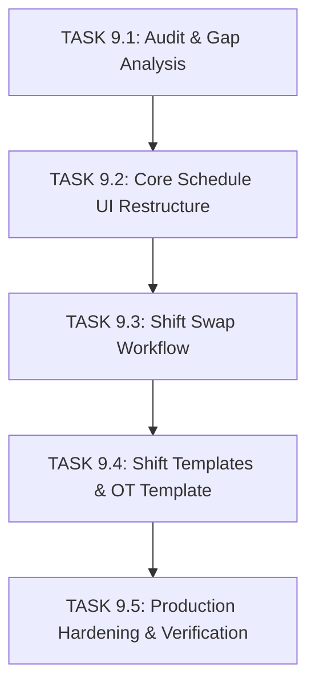

# TASK 9.1 — NEXUSHR EMS SCHEDULE MANAGEMENT IMPLEMENTATION PLAN

**Project**: NexusHR EMS / Employee Management System  
**Module**: Schedule Management (Day 9 Requirements)  
**Date**: August 28, 2026  
**Status**: APPROVED IMPLEMENTATION PLAN FOR TASKS 9.2 THROUGH 9.5  

---

## 1. Executive Summary & Phased Strategy

Following the comprehensive audit conducted in **TASK 9.1**, this implementation plan outlines the sequential, non-breaking execution steps required to bring the **Schedule Management** module into full compliance with authoritative Day 9 requirements.

The plan strictly adheres to the following principles:
1. **Design System Preservation**: Reuses existing NexusHR EMS tokens, cards, tables, tabs, modals, buttons, and light/dark theme variables. No new visual framework, fonts, or excessive styling will be introduced.
2. **Non-Breaking Architecture**: Modifies only Schedule Management files. Payroll, Attendance, Leave Management, and shared system components remain untouched.
3. **Clear Backend Boundaries**: All frontend state operations will use mock/service abstractions (`ScheduleService`) prepared for seamless backend integration in subsequent phases.

---

## 2. Master Phase Schedule



---

## 3. Detailed Phase Specifications

### Phase 1: TASK 9.1 — Audit & Gap Analysis (CURRENT TASK)
- **Goal**: Complete current-state evaluation, gap matrix, architectural audit, and deliverable documentation.
- **Deliverables**:
  - `EMS-Schedule-Management-Audit.md`
  - `EMS-Schedule-Management-Implementation-Plan.md`
- **Status**: **COMPLETE**

---

### Phase 2: TASK 9.2 — Core Schedule UI Restructure
- **Goal**: Reorganize `ShiftSchedule.tsx` into a clean 3-tab architecture, fix navbar/header labels, and purge OT monitoring/redundant metrics.
- **Key Tasks**:
  1. **Navbar & Labeling Fix**:
     - Update `navigation.ts` sidebar label from `"Schedule"` to `"Schedule Management"`.
     - Update `Layout.tsx` page title map `/schedule` entry to `"Schedule Management"`.
     - Update `ShiftSchedule.tsx` page header to `"Schedule Management"`.
  2. **Tab Container Implementation**:
     - Add top-level tab control (`[ Schedule ]`, `[ Requests ]`, `[ Shift Templates ]`).
     - Render main calendar views under `[ Schedule ]` tab.
     - Move Swap Requests table under `[ Requests ]` tab.
     - Move Shift Templates grid and OT Template under `[ Shift Templates ]` tab.
  3. **Staffing Metrics Cleanup**:
     - Remove top alerts bar (Coverage Status 94.2%, System Alerts, Ongoing Swaps).
     - Remove "Total Overtime 142h" KPI card.
     - Retain "Total Employees" and "Pending Swaps" KPI cards.
  4. **OT Monitoring Removal**:
     - Remove `#overtime-panel` (Overtime Monitoring card) from Schedule Management.
     - Remove "Fix Overtime Now" simulation trigger and OT report redirect.

---

### Phase 3: TASK 9.3 — Shift Swap Workflow
- **Goal**: Implement complete Shift Swap Request lifecycle and Manager Approval flow.
- **Key Tasks**:
  1. **Shift Swap Request Modal**:
     - Employee selection (Requester & Target Collaborator).
     - Current Shift selection & Requested Shift selection.
     - Date & Reason inputs.
     - Submit handler updating mock request list with state `PENDING`.
  2. **Requests Tab Table Component**:
     - Columns: `Request ID`, `Employee`, `Current Shift`, `Requested Shift`, `Date`, `Reason`, `Status`, `Submitted Date`, `Manager`, `Approved By`, `Approved Date`, `Actions`.
     - Status badges: `Pending`, `Manager Review`, `Approved`, `Rejected`, `Cancelled`.
     - Filter controls: Status filter, Search input, Department filter.
  3. **Manager Approval & Scope Validation**:
     - Manager review drawer showing full request context.
     - Action buttons: Approve, Reject (with mandatory rejection reason input).
     - Scope check: Verify manager authority over employee's department/team.
     - Auto-update schedule grid upon approval.

---

### Phase 4: TASK 9.4 — Shift Templates & Overtime Template
- **Goal**: Upgrade Shift Templates tab, implement Apply Template workflow with conflict detection, add Shift Count indicators, and create Editable Overtime Template.
- **Key Tasks**:
  1. **Shift Templates Tab Enhancements**:
     - Displays template grid with metadata: Name, Code, Start/End Time, Break Duration, Grace Period, Rotation Type, Working Hours, Status (Active/Disabled), Employee Count.
     - Actions: Create Template, Edit Template, View Details, Duplicate, Apply Template, Enable/Disable toggle.
  2. **Apply Shift Template Guardrails**:
     - Modal step 1: Select Template, Target (Employee / Team / Department), Date Range.
     - Modal step 2: Conflict Detection & Strategy (`Replace`, `Fill Gaps Only`, `Skip Conflicts`).
     - Confirmation summary before applying.
  3. **Shift Count Statistics**:
     - Display clear employee count breakdown per shift type across templates and calendar views.
  4. **Editable Overtime Template Component**:
     - Rendered within `[ Shift Templates ]` tab.
     - Configurable fields: `Template Name`, `Min OT Hours Threshold`, `Max OT Hours Cap`, `OT Rate Rule (e.g. 1.5x)`, `Weekday OT Rule`, `Weekend OT Rule`, `Holiday OT Rule`, `Approval Required Toggle`, `Status`.
     - Boundary Enforcement: Purely config for scheduling limits; no payroll payout math.

---

### Phase 5: TASK 9.5 — Hardening & Verification
- **Goal**: Apply canonical RBAC permissions, audit tenant scoping boundaries, abstract service layer, and execute build/test verification.
- **Key Tasks**:
  1. **RBAC Permission Verification**:
     - Super Admin / HR: Full access across all 3 tabs.
     - Manager: Access to `Schedule` and `Requests` tabs (scoped to assigned department).
     - Employee: Access to personal schedule and own swap requests.
  2. **Service Layer Abstraction**:
     - Ensure all schedule CRUD and request actions route through `ScheduleService` mock handlers.
  3. **Static Analysis & Build Verification**:
     - Run `npx tsc --noEmit`.
     - Run `npm run build`.
     - Confirm zero regressions across unrelated EMS modules.

---

## 4. Source File Change Checklist

| Target File Path | Planned Edits in Task 9.2+ |
|---|---|
| `src/app/shared/permission-engine/navigation.ts` | Change label `"Schedule"` to `"Schedule Management"` |
| `src/app/components/Layout.tsx` | Change pageTitle `"/schedule"` to `"Schedule Management"` |
| `src/app/pages/hr/hr-operations/ShiftSchedule.tsx` | Full UI restructure into 3 tabs, metric cleanup, OT monitoring removal, tab components integration |
| `src/app/pages/employee/EmployeeSchedule.tsx` | Align request payload fields with unified `SwapRequestItem` schema |
| `src/app/pages/manager/team/ManagerTeamSchedule.tsx` | Enforce manager scope filtering and approval integration |

---

## 5. Verification Commands

Upon completing each subsequent task (Task 9.2 through 9.5), the following verification pipeline will be executed:

```bash
# 1. Type Safety Check
npx tsc --noEmit

# 2. Production Build Test
npm run build
```

---

## 6. Declarations & Sign-off

- **Task 9.1 Status**: **PASS**
- **Audit**: **COMPLETE**
- **UI Implementation**: **NOT YET STARTED**
- **Backend Integration**: **DEFERRED TO UNIFIED BACKEND PHASE**
- **Next Task**: **TASK 9.2 — CORE SCHEDULE UI RESTRUCTURE**
