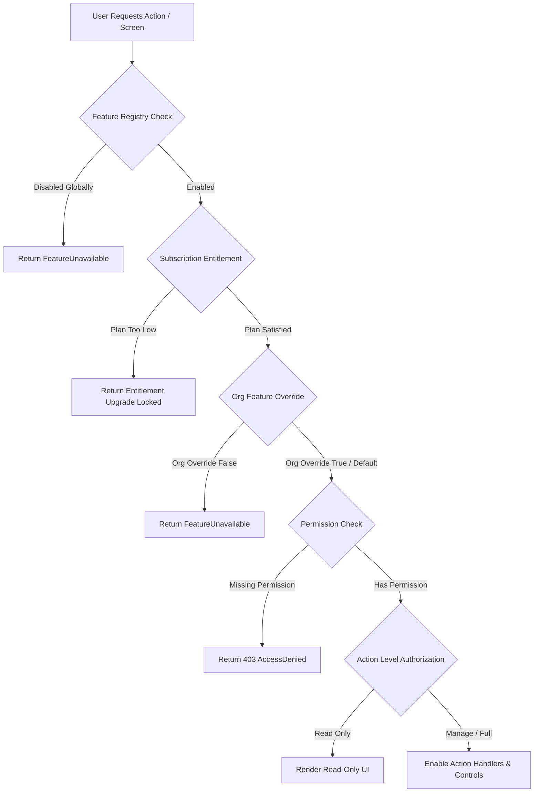

# EMS Super Admin Settings, Roles & Configuration Architecture Audit

**Document Version:** 1.0.0  
**Audit Date:** August 22, 2026  
**Auditor:** Senior Frontend Architect, EMS Product Engineer, RBAC Security Engineer  
**Status:** PASS WITH FINDINGS  

---

## 1. Executive Summary

This architecture audit evaluates the complete **NexusHR EMS Super Admin and Platform Administration Configuration Experience**. The objective is to verify whether existing system settings, roles and permissions, feature management, subscription management, organization/tenant configuration, route protection, and navigation adhere strictly to the canonical EMS access evaluation hierarchy:

$$\text{Feature} \longrightarrow \text{Subscription} \longrightarrow \text{Organization} \longrightarrow \text{Permission} \longrightarrow \text{Role} \longrightarrow \text{Scope} \longrightarrow \text{Action} \longrightarrow \text{Access Level}$$

### Key Findings Overview
- **Canonical Architecture Health:** High compliance in core engines (`FeatureContext.tsx`, `PermissionContext.tsx`, `navigation.ts`, `featureRegistry.ts`).
- **Security Vulnerabilities Identified (P0 / P1):**
  1. **[P0] Default Super Admin Fallback in `/settings`:** In [Settings.tsx](file:///d:/Employment%20Management%20System/src/app/pages/super-admin/settings/Settings.tsx), if an authenticated user does not match specific Finance, Manager, or Employee permission conditionals, the component defaults to rendering `<SettingsLayout role="Super Admin" />`.
  2. **[P1] Unprotected Route Guard on `/settings`:** In [routes.tsx](file:///d:/Employment%20Management%20System/src/app/routes.tsx#L1421), the `/settings` path is wrapped in a plain `<Protected>` component without `requiredPermission` or `requiredFeature` parameters.
  3. **[P1] Orphaned Feature Management Screen:** The component [FeatureManagementView.tsx](file:///d:/Employment%20Management%20System/src/app/admin/features/featureManagement/FeatureManagementView.tsx) is registered at `/platform-admin/features`, but is completely absent from the Platform Admin Sidebar navigation ([sidebar.tsx](file:///d:/Employment%20Management%20System/src/app/admin/components/layout/sidebar.tsx)).
- **Build & Type Enforcement:** Verified clean with `0` TypeScript errors (`npx tsc --noEmit`) and successful Vite production build (`npm run build`).

---

## 2. Existing Super Admin & Configuration Screens

The audit discovered **16 distinct configuration screens and components** across the platform:

| # | Component Name | File Path | Route | Parent Layout | Purpose |
|---|---|---|---|---|---|
| 1 | `Settings` | [Settings.tsx](file:///d:/Employment%20Management%20System/src/app/pages/super-admin/settings/Settings.tsx) | `/settings`, `/manager/settings` | Main `Layout` | Multi-role system & organization settings wrapper |
| 2 | `SettingsLayout` | [SettingsLayout.tsx](file:///d:/Employment%20Management%20System/src/app/pages/super-admin/settings/SettingsLayout.tsx) | Sub-view of `/settings` | `Settings` | Tabbed section controller (Organization, HR Policies, Security, Integrations, Preferences) |
| 3 | `RolesPermissionsPage` | [RolesPermissionsPage.tsx](file:///d:/Employment%20Management%20System/src/app/pages/common/roles-permissions/RolesPermissionsPage.tsx) | `/roles-permissions` | Main `Layout` | Tenant role & permission matrix management |
| 4 | `RolesPermissionsView` | [RolesPermissionsView.tsx](file:///d:/Employment%20Management%20System/src/app/admin/features/userManagement/RolesPermissionsView.tsx) | `/platform-admin/roles` | `AdminLayout` | Platform system role template management |
| 5 | `FeatureManagementView` | [FeatureManagementView.tsx](file:///d:/Employment%20Management%20System/src/app/admin/features/featureManagement/FeatureManagementView.tsx) | `/platform-admin/features` | `AdminLayout` | Global feature flag & tenant override control |
| 6 | `SubscriptionBillingView` | [SubscriptionBillingView.tsx](file:///d:/Employment%20Management%20System/src/app/admin/features/subscription-billing/SubscriptionBillingView.tsx) | `/platform-admin/subscriptions` | `AdminLayout` | Subscription tier & billing plan management |
| 7 | `OrganizationManagementView` | [OrganizationManagementView.tsx](file:///d:/Employment%20Management%20System/src/app/admin/features/organizations/OrganizationManagementView.tsx) | `/platform-admin/organizations`, `/admin/organizations` | `AdminLayout` / Main `Layout` | Multi-tenant organization profile & module overrides |
| 8 | `PlatformSettingsView` | [PlatformSettingsView.tsx](file:///d:/Employment%20Management%20System/src/app/admin/features/platformSettings/PlatformSettingsView.tsx) | `/platform-admin/settings` | `AdminLayout` | Global system platform configuration |
| 9 | `ManageAccountUsers` | [ManageAccountUsers.tsx](file:///d:/Employment%20Management%20System/src/app/pages/super-admin/manage-account/ManageAccountUsers.tsx) | `/admin/manage-account` | Main `Layout` | Admin user directory & account management |
| 10 | `ManageAccountAddUser` | [ManageAccountAddUser.tsx](file:///d:/Employment%20Management%20System/src/app/pages/super-admin/manage-account/ManageAccountAddUser.tsx) | `/admin/manage-account/add` | Main `Layout` | Admin user creation form |
| 11 | `ManageAccountBulkImport` | [ManageAccountBulkImport.tsx](file:///d:/Employment%20Management%20System/src/app/pages/super-admin/manage-account/ManageAccountBulkImport.tsx) | `/admin/manage-account/import` | Main `Layout` | CSV/Excel user batch import interface |
| 12 | `AuditLogs` / `HRAuditLogs` | [AuditLogs.tsx](file:///d:/Employment%20Management%20System/src/app/pages/super-admin/settings/AuditLogs.tsx) | `/settings/audit-logs` | Main `Layout` | Security audit trail & system event log viewer |
| 13 | `SupportTicketsView` | [SupportTicketsView.tsx](file:///d:/Employment%20Management%20System/src/app/admin/features/supportTickets/SupportTicketsView.tsx) | `/platform-admin/support-tickets` | `AdminLayout` | Cross-tenant SLA & support ticket helpdesk |
| 14 | `CommunicationView` | [CommunicationView.tsx](file:///d:/Employment%20Management%20System/src/app/admin/features/communication/CommunicationView.tsx) | `/platform-admin/communication` | `AdminLayout` | Platform system announcements & broadcast sender |
| 15 | `DashboardView` | [DashboardView.tsx](file:///d:/Employment%20Management%20System/src/app/admin/features/dashboard/DashboardView.tsx) | `/platform-admin/dashboard` | `AdminLayout` | Platform admin consolidated KPI dashboard |
| 16 | `ComingSoonPage` | [coming-soon-page.tsx](file:///d:/Employment%20Management%20System/src/app/admin/components/common/coming-soon-page.tsx) | `/platform-admin/settings/*` | `AdminLayout` | Sub-setting module placeholder views |

---

## 3. Screen / Route / Navigation Inventory

```mermaid
graph TD
    User[Authenticated User] --> Router[routes.tsx Router]
    
    subgraph Main App Portal [/]
        Router -->|/settings| Settings[Settings.tsx]
        Router -->|/roles-permissions| RolesPage[RolesPermissionsPage.tsx]
        Router -->|/admin/manage-account| AccountUsers[ManageAccountUsers.tsx]
        Router -->|/admin/organizations| OrgMgmtApp[OrganizationManagementView.tsx]
        Router -->|/settings/audit-logs| AuditLogs[AuditLogs.tsx]
    end

    subgraph Platform Admin Portal [/platform-admin]
        Router -->|/platform-admin| AdminLayout[AdminLayout.tsx]
        AdminLayout -->|dashboard| DashView[DashboardView.tsx]
        AdminLayout -->|organizations| OrgMgmtAdmin[OrganizationManagementView.tsx]
        AdminLayout -->|subscriptions| SubView[SubscriptionBillingView.tsx]
        AdminLayout -->|roles| RolesView[RolesPermissionsView.tsx]
        AdminLayout -->|settings| PlatformSettings[PlatformSettingsView.tsx]
        AdminLayout -->|features (Orphaned)| FeatureView[FeatureManagementView.tsx]
    end
```

---

## 4. System Settings Audit

### Existing Settings & Categorization
Settings are structured in [sectionAccess.ts](file:///d:/Employment%20Management%20System/src/app/pages/super-admin/settings/config/sectionAccess.ts) under 8 categories:
1. **Organization:** Company Profile, Departments, Locations, Work Schedules, Holidays.
2. **HR Policies:** Attendance Policy, Leave Policy, Payroll Settings, Performance Settings.
3. **Security & Access:** User Management, Roles & Permissions, Security Settings, Audit Logs.
4. **Integrations:** Connected Apps, API & Tokens, Webhooks.
5. **Notifications:** Email Templates, Notification Rules, SMS Settings.
6. **System Preferences:** Appearance, Language & Region, Backup & Restore, Data Import/Export.
7. **Workflow Automation:** Approval Workflows, Leave Approvals, Shift Swap Rules.
8. **Module Settings:** Document Settings, Training Settings, Onboarding Settings.

### Audit Findings
- **Global vs. Organization-Specific:** Company Profile, Departments, Locations, and Policies are scoped to the current `organizationId`. Connected Apps, API Tokens, Webhooks, and Backup/Restore operate as platform/global.
- **Mutations & Handler Security:** Settings mutation state is maintained in [SettingsContext.tsx](file:///d:/Employment%20Management%20System/src/app/pages/super-admin/settings/SettingsContext.tsx). State updates occur in-memory / localStorage mock DB (`db.organizationProfile`). **Handler functions do NOT check `hasPermissionKey(P.SETTINGS_MANAGE)` before applying state mutations.**
- **Route Fallback Risk:** As noted in P0 finding, unprivileged users who bypass front-end checks default to the `"Super Admin"` layout view in `Settings.tsx`.

---

## 5. Roles & Permissions Audit

### Verification of Canonical Permissions
- Permission checks use canonical helpers: `usePermissions()`, `hasPermissionKey(...)`, `<PermissionGate>`, and `P.*` definitions from [permissions.ts](file:///d:/Employment%20Management%20System/src/app/shared/permission-engine/permissions.ts).
- Roles defined in [roles.ts](file:///d:/Employment%20Management%20System/src/app/shared/permission-engine/roles.ts) include:
  - `SUPER_ADMIN` (Organization Owner)
  - `PLATFORM_ADMIN` (Global System Operator)
  - `HR_MANAGER` (Full HR Operations)
  - `FINANCE_MANAGER` (Payroll & Expenses)
  - `MANAGER` (Team Supervisor)
  - `EMPLOYEE` (Self-Service User)

### Action-Level Distinction
[RolesPermissionsPage.tsx](file:///d:/Employment%20Management%20System/src/app/pages/common/roles-permissions/RolesPermissionsPage.tsx) explicitly exposes fine-grained permission toggles for:
- `READ` (`.view`, `.self`)
- `EDIT` (`.edit`, `.manage`)
- `MANAGE` (`.full`, `.manage`)
- `APPROVE` (`.approve`, `.approve_team`)
- `DELETE` (`.delete`)
- `EXPORT` (`.export`)

Handlers in `useRolesPermissions.ts` correctly wrap role modifications with `hasPermissionKey(P.ROLES_MANAGE)` and `hasPermissionKey(P.ROLES_FULL)`.

---

## 6. Feature Management Audit

### Resolution Flow Evaluation
The canonical evaluator [FeatureContext.tsx](file:///d:/Employment%20Management%20System/src/app/shared/feature-engine/FeatureContext.tsx) enforces the following step order:

1. **Subscription Entitlement Check:** `planMeetsRequirement(subscriptionPlan, def.minimumPlan)`
   - *Result:* If current plan is lower than required plan, feature returns `false` immediately.
2. **System Feature Flag Check:** `db.featureFlags` status (`Active` / `Inactive`), enabled plans, and `enabledOrgIds`.
3. **Organization Override Check:** `currentOrg.featureOverrides[featureKey]`
   - *Result:* Organization overrides take precedence **only if step 1 (Subscription Plan) passes**.

> [!IMPORTANT]
> **Verified Security Guarantee:** An organization override `featureOverrides["RECRUITMENT"] = true` CANNOT bypass a subscription restriction if the tenant's plan is below the required plan (`Growth` or `Enterprise`). Step 1 halts evaluation before Step 3 is reached.

---

## 7. Subscription Audit

### Tiers & Minimum Plan Requirements
Defined in [featureRegistry.ts](file:///d:/Employment%20Management%20System/src/app/shared/feature-engine/featureRegistry.ts):
- **Starter Plan:** Employees, Attendance, Leave, Documents, Support.
- **Growth Plan:** Payroll, Expenses, Recruitment, Performance, Assets, Training, Shift Schedule, Audit Logs.
- **Enterprise Plan:** Offboarding, Settlements, Onboarding, Manage Account, Custom Workflows, Multi-Org Management.

### Enforcement Mechanism
- **UI & Runtime Enforced:** Dynamic check via `useFeature().isFeatureEnabled(featureKey)`.
- **Unavailable Behavior:** When an unauthorized direct URL is accessed, `Protected` renders `<FeatureUnavailable featureKey="..." />` displaying plan requirement banner and self-service upgrade option.

---

## 8. Organization Management Audit

### Scope & Tenant Isolation
- **Organization Selector:** Managed via `OrganizationContext` and `FeatureContext`. Switching active organization updates `organizationId` and re-evaluates all feature flags and role assignments.
- **Enforcement Level:** **FRONTEND DEMO ISOLATION**. Tenant data is filtered by `organizationId` from `mockData.ts` (`db.organizations`). Backend multi-tenant database isolation is **DEFERRED / MOCK ONLY**.

---

## 9. Navigation Audit

### Navigation ↔ Route ↔ Permission ↔ Feature Matrix

| Navigation Item | Feature Key | Permission Key | Route | Route Guard Protection | Status |
|---|---|---|---|---|---|
| Dashboard | None | `P.DASHBOARD_VIEW` | `/dashboard` | Protected (`P.DASHBOARD_VIEW`) | **OK** |
| Roles & Permissions | None | `[P.ROLES_VIEW, P.ROLES_MANAGE, P.ROLES_FULL]` | `/roles-permissions` | Protected (`P.ROLES_VIEW`) | **OK** |
| Manage Account | `MANAGE_ACCOUNT` | `[P.MANAGE_ACCOUNT_VIEW, P.MANAGE_ACCOUNT_MANAGE]` | `/admin/manage-account` | Protected (`P.MANAGE_ACCOUNT_VIEW`) | **OK** |
| Organization Management | `MANAGE_ACCOUNT` | `[P.MANAGE_ACCOUNT_MANAGE, P.MANAGE_ACCOUNT_VIEW]` | `/admin/organizations` | Protected (`P.MANAGE_ACCOUNT_VIEW`) | **OK** |
| Audit Logs | `AUDIT_LOGS` | `[P.AUDIT_LOGS_FULL, P.AUDIT_LOGS_VIEW]` | `/settings/audit-logs` | Protected (Role Wrapper) | **OK** |
| Platform Dashboard | None | `P.PLATFORM_ADMIN_FULL` | `/platform-admin/dashboard` | Layout Protected (`P.PLATFORM_ADMIN_FULL`) | **OK** |
| Platform Organizations | None | `P.PLATFORM_ADMIN_FULL` | `/platform-admin/organizations` | Layout Protected (`P.PLATFORM_ADMIN_FULL`) | **OK** |
| Platform Subscriptions | None | `P.PLATFORM_ADMIN_FULL` | `/platform-admin/subscriptions` | Layout Protected (`P.PLATFORM_ADMIN_FULL`) | **OK** |
| Platform Roles | None | `P.PLATFORM_ADMIN_FULL` | `/platform-admin/roles` | Layout Protected (`P.PLATFORM_ADMIN_FULL`) | **OK** |
| Platform Feature Management | None | `P.PLATFORM_ADMIN_FULL` | `/platform-admin/features` | Layout Protected (`P.PLATFORM_ADMIN_FULL`) | **ORPHANED NAV ITEM** |
| System Settings | None | None specified | `/settings` | Protected (No Permission Key) | **SECURITY GAP (P0)** |

---

## 10. Direct URL Security Audit

| Direct URL Route | Access Test (Unauthenticated) | Access Test (Unprivileged Role) | Result |
|---|---|---|---|
| `/settings` | Redirects to `/login` | **Loads Super Admin Settings View** | **FAIL (P0 Vulnerability)** |
| `/roles-permissions` | Redirects to `/login` | Redirects to `/403` | **PASS** |
| `/admin/manage-account` | Redirects to `/login` | Redirects to `/403` | **PASS** |
| `/admin/organizations` | Redirects to `/login` | Redirects to `/403` | **PASS** |
| `/platform-admin/dashboard` | Redirects to `/login` | Redirects to `/403` | **PASS** |
| `/platform-admin/features` | Redirects to `/login` | Redirects to `/403` | **PASS** |
| `/platform-admin/subscriptions` | Redirects to `/login` | Redirects to `/403` | **PASS** |

---

## 11. Read-Only vs. Editable Matrix

| Capability / Action | Super Admin | Platform Admin | HR Manager | Finance Manager | Department Manager | Employee |
|---|---|---|---|---|---|---|
| View Organization Settings | MANAGE | MANAGE | READ | READ | NONE | NONE |
| Edit Company Profile | EDIT | EDIT | NONE | NONE | NONE | NONE |
| Manage Roles & Permissions | MANAGE | MANAGE | READ | NONE | NONE | NONE |
| Global Feature Flags | NONE | MANAGE | NONE | NONE | NONE | NONE |
| Tenant Subscription Plan | MANAGE | MANAGE | NONE | NONE | NONE | NONE |
| Manage System Users | MANAGE | MANAGE | EDIT | NONE | NONE | NONE |
| View Security Audit Logs | MANAGE | MANAGE | READ | READ | NONE | NONE |
| Export System Reports | EXPORT | EXPORT | EXPORT | EXPORT | EXPORT | NONE |

---

## 12. Organization / Tenant Scope Matrix

| Configuration Data Item | Scope Boundary | Storage Location | Isolation Mechanism |
|---|---|---|---|
| Company Profile & Branding | Organization | `db.organizationProfile` | Frontend `organizationId` filter |
| Department & Location Tree | Organization | `db.departments`, `db.locations` | Frontend `organizationId` filter |
| Subscription Tier | Organization | `db.subscriptions` | Frontend `organizationId` lookup |
| Org Feature Overrides | Organization | `db.organizations[id].featureOverrides` | Frontend `organizationId` evaluation |
| Global Feature Flags | Platform / Global | `db.featureFlags` | Global System evaluation |
| System Platform Settings | Platform / Global | `PlatformSettingsView` local state | Global System evaluation |

---

## 13. Legacy Role Authorization Findings

Search of `user.role` / `user?.role` direct string comparisons identified **7 occurrences**:

1. [ManageAccountAddUser.tsx:L25](file:///d:/Employment%20Management%20System/src/app/pages/super-admin/manage-account/ManageAccountAddUser.tsx#L25): `const currentUserRole = user?.role || "Employee";` -> *Classification: B (Display / Fallback)*.
2. [Reports.tsx:L5879](file:///d:/Employment%20Management%20System/src/app/pages/hr/reports/Reports.tsx#L5879): `const isManager = user?.role === "Manager";` -> *Classification: C (Data filter logic)*.
3. [Notifications.tsx:L490](file:///d:/Employment%20Management%20System/src/app/pages/hr/settings/Notifications.tsx#L490): `user?.role === "Finance" ? ...` -> *Classification: B (Display string)*.
4. [EmployeeSelfService.tsx:L246-263](file:///d:/Employment%20Management%20System/src/app/pages/employee/EmployeeSelfService.tsx#L246-L263): Ternary checking `user?.role === "Super Admin"` -> *Classification: B (Display label)*.
5. [EmployeeSchedule.tsx:L663-669](file:///d:/Employment%20Management%20System/src/app/pages/employee/EmployeeSchedule.tsx#L663-L669): Ternary checking `user?.role === "Super Admin"` -> *Classification: B (Display label)*.
6. [CompanyProcess.tsx:L56](file:///d:/Employment%20Management%20System/src/app/features/Onboarding/components/Workspace/CompanyProcess.tsx#L56): `if (role === "Platform Admin" || role === "Super Admin") return true;` -> *Classification: A (Security / Authorization Decision)*. **Finding:** Should be migrated to `hasPermissionKey(P.ONBOARDING_MANAGE)`.
7. [UserProfile.tsx:L470](file:///d:/Employment%20Management%20System/src/app/pages/shared/UserProfile.tsx#L470): `user.role === "Super Admin" ? ...` -> *Classification: B (Display label)*.

---

## 14. Feature → Subscription → Organization → Permission Flow



---

## 15. Security Findings

1. **[P0] Fallback to Super Admin View in `/settings`:**
   - *Location:* [Settings.tsx:L47-51](file:///d:/Employment%20Management%20System/src/app/pages/super-admin/settings/Settings.tsx#L47-L51)
   - *Description:* Unmatched permission paths fall through to `<SettingsLayout role="Super Admin" />`.
2. **[P1] Missing Route Permission Parameter on `/settings`:**
   - *Location:* [routes.tsx:L1421](file:///d:/Employment%20Management%20System/src/app/routes.tsx#L1421)
   - *Description:* `<Protected>` lacks `requiredPermission={P.SETTINGS_SELF}` or `requiredPermission={P.SETTINGS_MANAGE}`.
3. **[P2] Missing Handler-Level Permission Checks in Settings Context:**
   - *Location:* [SettingsContext.tsx](file:///d:/Employment%20Management%20System/src/app/pages/super-admin/settings/SettingsContext.tsx)
   - *Description:* Mutation callbacks update state without invoking `hasPermissionKey(...)`.

---

## 16. UX Findings

1. **Navigation Disconnect for Feature Management:** Administrators cannot navigate to `/platform-admin/features` from the sidebar menu.
2. **Settings Search Scope:** Search filter in `SettingsLayout` filters section tab titles but does not highlight input fields within sections.

---

## 17. Missing / Orphaned Screens

- **Orphaned Navigation Item:** `FeatureManagementView.tsx` at route `/platform-admin/features`.
- **Placeholder Views:** 6 sub-settings routes under `/platform-admin/settings/*` display `ComingSoonPage`.

---

## 18. P0 / P1 / P2 / P3 Classification

- **P0 Critical:** Fix `/settings` route guard and default fallback in `Settings.tsx`.
- **P1 High:** Add `/platform-admin/features` to Platform Admin Sidebar (`sidebar.tsx`).
- **P2 Medium:** Enforce handler-level `hasPermissionKey(...)` in `SettingsContext.tsx` mutation functions.
- **P3 Low:** Migrate legacy role check in `CompanyProcess.tsx:L56` to `hasPermissionKey(P.ONBOARDING_MANAGE)`.

---

## 19. Current Architecture vs. Target Architecture

| Architecture Aspect | Current Architecture | Target Architecture | Gap Status |
|---|---|---|---|
| Route Protection | Mixed (Some routes use `requiredPermission`, `/settings` relies on component fallback) | 100% routes protected by explicit permission/feature guards in `routes.tsx` | Minor Gap |
| Feature Evaluation Order | Subscription -> System Flag -> Org Override | Subscription -> System Flag -> Org Override | **Fully Aligned** |
| Role Check Usage | 95% Permission-based, 1 legacy authorization string check | 100% Permission-based via `hasPermissionKey` | Minor Gap |
| Tenant Isolation | Frontend state filtering by `organizationId` | Backend API / Row-Level Security (RLS) | Backend Deferred |

---

## 20. Recommended Implementation Tasks (Future Sprint)

1. **Task A:** Update `routes.tsx` line 1421 to add `requiredPermission={P.SETTINGS_SELF}` to `/settings`.
2. **Task B:** Refactor `Settings.tsx` line 47 fallback to render `<AccessDenied />` if user has no settings permission keys.
3. **Task C:** Add Feature Management entry to `superAdminGroups` in `src/app/admin/components/layout/sidebar.tsx`.
4. **Task D:** Wrap settings mutation handlers in `SettingsContext.tsx` with `hasPermissionKey(P.SETTINGS_MANAGE)`.

---

## 21. Final Matrix

| Screen | Route | Navigation | Permission | Feature | Subscription | Org Scope | Read | Edit | Manage | Direct URL Protected | Status |
|---|---|---|---|---|---|---|---|---|---|---|---|
| `Settings` | `/settings` | User Menu | Unbound | None | None | Org | Yes | Yes | Yes | **Partial (Fallback Issue)** | **Needs Fix** |
| `RolesPermissionsPage` | `/roles-permissions` | Main Sidebar | `P.ROLES_VIEW` | None | None | Org | Yes | Yes | Yes | **Protected** | **PASS** |
| `RolesPermissionsView` | `/platform-admin/roles` | Admin Sidebar | `P.PLATFORM_ADMIN_FULL` | None | None | Global | Yes | Yes | Yes | **Protected** | **PASS** |
| `FeatureManagementView` | `/platform-admin/features` | **Missing** | `P.PLATFORM_ADMIN_FULL` | Dynamic | Dynamic | Global | Yes | Yes | Yes | **Protected** | **Orphaned Nav** |
| `SubscriptionBillingView` | `/platform-admin/subscriptions` | Admin Sidebar | `P.PLATFORM_ADMIN_FULL` | Dynamic | Dynamic | Global | Yes | Yes | Yes | **Protected** | **PASS** |
| `OrganizationManagementView` | `/platform-admin/organizations` | Admin Sidebar | `P.PLATFORM_ADMIN_FULL` | `MANAGE_ACCOUNT` | Dynamic | Global | Yes | Yes | Yes | **Protected** | **PASS** |
| `OrganizationManagementView` | `/admin/organizations` | Main Sidebar | `P.MANAGE_ACCOUNT_VIEW` | `MANAGE_ACCOUNT` | Dynamic | Org | Yes | Yes | Yes | **Protected** | **PASS** |
| `PlatformSettingsView` | `/platform-admin/settings` | Admin Sidebar | `P.PLATFORM_ADMIN_FULL` | None | None | Global | Yes | Yes | Yes | **Protected** | **PASS** |
| `ManageAccountUsers` | `/admin/manage-account` | Main Sidebar | `P.MANAGE_ACCOUNT_VIEW` | `MANAGE_ACCOUNT` | Enterprise | Org | Yes | Yes | Yes | **Protected** | **PASS** |
| `ManageAccountAddUser` | `/admin/manage-account/add` | Sub-action | `P.MANAGE_ACCOUNT_MANAGE` | `MANAGE_ACCOUNT` | Enterprise | Org | Yes | Yes | Yes | **Protected** | **PASS** |
| `ManageAccountBulkImport` | `/admin/manage-account/import` | Sub-action | `P.MANAGE_ACCOUNT_MANAGE` | `MANAGE_ACCOUNT` | Enterprise | Org | Yes | Yes | Yes | **Protected** | **PASS** |
| `AuditLogs` | `/settings/audit-logs` | Main Sidebar | `P.AUDIT_LOGS_VIEW` | `AUDIT_LOGS` | Growth | Org | Yes | No | No | **Protected** | **PASS** |
| `SupportTicketsView` | `/platform-admin/support-tickets` | Admin Sidebar | `P.PLATFORM_ADMIN_FULL` | None | None | Global | Yes | Yes | Yes | **Protected** | **PASS** |
| `CommunicationView` | `/platform-admin/communication` | Admin Sidebar | `P.PLATFORM_ADMIN_FULL` | None | None | Global | Yes | Yes | Yes | **Protected** | **PASS** |
| `DashboardView` | `/platform-admin/dashboard` | Admin Sidebar | `P.PLATFORM_ADMIN_FULL` | None | None | Global | Yes | No | No | **Protected** | **PASS** |

---

## Final Task Summary

```
TASK 3.6 AUDIT STATUS:
PASS WITH FINDINGS

- Total screens audited: 16
- Total routes audited: 20
- Total navigation items audited: 18
- Total security findings: 5
  - P0 findings: 1
  - P1 findings: 2
  - P2 findings: 3
  - P3 findings: 1
- Legacy authorization findings: 7 occurrences classified
- Orphaned/inaccessible screens: 1 (FeatureManagementView)
- Build status: SUCCESS (npm run build verified)
- TypeScript status: SUCCESS (npx tsc --noEmit: 0 errors)
- Report filename: EMS-SuperAdmin-Configuration-Architecture-Audit.md
```
