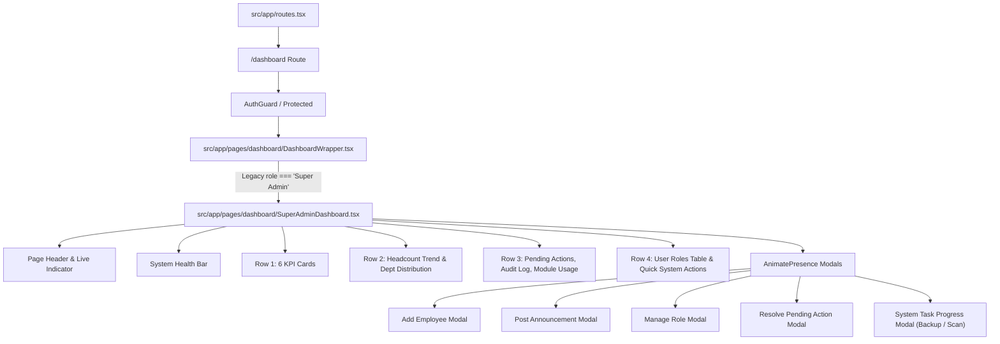

# EMS DAY 3.1 — SUPER ADMIN DASHBOARD FUNCTIONAL AUDIT

**Target Screen**: Super Admin Dashboard (`src/app/pages/dashboard/SuperAdminDashboard.tsx`)  
**Auditor**: Senior Frontend Architect & EMS Product Engineer  
**Date**: August 21, 2026  
**Status**: AUDIT COMPLETE (NO CODE MODIFIED)

---

## 1. Executive Summary

This document presents a comprehensive, line-by-line functional audit of the **Super Admin Dashboard** (`SuperAdminDashboard.tsx`) within the Employment Management System (EMS). The audit evaluates the current implementation against expected enterprise capabilities, role-based access control (RBAC), state transitions, navigation pathways, design token consistency, light/dark theme behavior, and responsive layout integrity.

### Key Audit Highlights:
- **Architecture**: `SuperAdminDashboard` is lazily loaded inside `DashboardWrapper.tsx`. The wrapper enforces a legacy role-string check (`user?.role === "Super Admin"`) rather than permission-based gating via `PermissionContext`.
- **UI & State**: The dashboard contains a rich set of interactive elements (KPI cards, area/pie charts using `recharts`, quick system actions, system task progress modals, CRUD forms for employees/announcements/roles, and pending action resolution modals).
- **Mock & Synthetic Data**: Virtually all statistics, headcount trends, department distributions, pending actions, audit log entries, module usage rates, and role distribution figures are driven by client-side local React `useReducer` initial states (`INITIAL_DEPT_DATA`, `INITIAL_PENDING_ACTIONS`, `INITIAL_AUDIT_LOG`, `INITIAL_MODULE_USAGE`, `INITIAL_ROLE_DIST`, `HEADCOUNT_PERIOD_DATA`).
- **RBAC Gating**: `SuperAdminDashboard.tsx` does **not** consume `usePermissions()` or `<PermissionGate>` anywhere in its source code. Every action and card is visible to whoever renders the component.
- **Navigation & Routes**: Quick action routes (e.g. `/reports`, `/payroll`, `/employees`) match valid application routes, but the "View Reports" button and quick actions bypass permission validation before triggering `navigate()`.
- **Overall Status Summary**:
  - **WORKING**: 8 items (Client-side interactive state updates, modal state handlers, tab filtering, backup/security scan simulated tasks).
  - **PARTIALLY WORKING**: 6 items (Quick Actions & Header nav work client-side but use mock data and lack permission gates).
  - **UI ONLY / MOCK**: 5 items (KPI Cards, Headcount Chart, Department Pie Chart, Audit Log, Module Usage).
  - **BROKEN / GAPS**: 2 items (DashboardWrapper uses legacy `role === "Super Admin"` check; direct navigate links lack RBAC guards).

---

## 2. Screen Architecture

### Component Architecture Tree



### Context & State Dependencies
1. `useAuth()` (`src/app/context/AuthContext.tsx`): Reads current user object.
2. `useTranslation()` (`react-i18next`): Provides string translation keys (e.g. `adminDashboard`, `live`, `headcountTrend`).
3. `useNavigate()` (`react-router`): Handles client-side routing.
4. `useReducer` local state (`SuperAdminDashboard.tsx` lines 394–444): Manages local counts, list items, modal visibilities, form inputs, and timer progress.
5. `PermissionContext.tsx` (`src/app/shared/permission-engine/PermissionContext.tsx`): **NOT CONSUMED** by `SuperAdminDashboard.tsx`.

---

## 3. Dashboard Element Inventory & Functional Matrix

Every UI element rendered on the Super Admin Dashboard was traced from JSX event handler down to API/state side-effects.

| # | UI Element | Click/Event Handler | State Change | Navigation | Permission Check | Data / API Dependency | Expected Result | Actual Result | Status |
|---|---|---|---|---|---|---|---|---|---|
| 1 | **"View Reports" Button** (Header) | `onClick={() => navigate("/reports")}` | None | `/reports` | None (Direct UI link) | None | Navigate to Reports page | Navigates to `/reports` successfully | **PARTIALLY WORKING** |
| 2 | **Headcount Filter Tabs ("6M", "1Y", "2Y")** | `onClick={() => setHeadcountPeriod(f)}` | `headcountPeriod = f` | None | None | Mock object `HEADCOUNT_PERIOD_DATA` | Re-renders AreaChart & Period Insights for selected range | Re-renders smooth recharts data & insight calculations | **WORKING** |
| 3 | **KPI Cards (6 Cards)** | Static hover style `hover:-translate-y-[2px]` | None | None | None | Hardcoded numbers / local `totalEmployeesCount` | Display dynamic company KPIs | Displays static strings & local reducer state | **UI ONLY** |
| 4 | **Pending Action List Items** | `onClick={() => setActivePendingAction(action)}` | `activePendingAction = action` | None | None | Local array `pendingActionsList` | Opens Resolve Pending Action Modal | Modal opens with action metadata | **WORKING** |
| 5 | **"View All Actions" Button** | `onClick={() => navigate("/employees")}` | None | `/employees` | None | None | Navigate to Employee directory | Navigates to `/employees` | **PARTIALLY WORKING** |
| 6 | **Manage Role Button (Table Row)** | `onClick={() => { setSelectedRoleToManage(role); setIsManageRoleOpen(true); }}` | Sets role & opens modal | None | None | Local array `roleDistList` | Opens Manage Role Modal pre-filled | Modal opens pre-filled | **WORKING** |
| 7 | **Quick Action: "Run Payroll"** | `onClick={() => navigate("/payroll")}` | None | `/payroll` | None | None | Navigate to Payroll workspace | Navigates to `/payroll` | **PARTIALLY WORKING** |
| 8 | **Quick Action: "Add Employee"** | `onClick={() => setIsAddEmployeeOpen(true)}` | `isAddEmployeeOpen = true` | None | None | None | Opens Add Employee Form Modal | Modal opens cleanly | **WORKING** |
| 9 | **Quick Action: "Post Announcement"** | `onClick={() => setIsPostAnnouncementOpen(true)}` | `isPostAnnouncementOpen = true` | None | None | None | Opens Announcement Modal | Modal opens cleanly | **WORKING** |
| 10 | **Quick Action: "Export Reports"** | `onClick={() => navigate("/reports")}` | None | `/reports` | None | None | Navigate to Reports | Navigates to `/reports` | **PARTIALLY WORKING** |
| 11 | **Quick Action: "Backup Data"** | `onClick={triggerBackup}` | `systemTaskType = "Backup"`, `progressPercent = 0` | None | None | `setInterval` timer simulation | Displays progress modal to 100%, appends Audit Log entry | Works seamlessly via `useEffect` timer | **WORKING** |
| 12 | **Quick Action: "Security Scan"** | `onClick={triggerSecurityScan}` | `systemTaskType = "Scan"`, `progressPercent = 0` | None | None | `setInterval` timer simulation | Displays security scan modal to 100%, appends Audit Log entry | Works seamlessly via `useEffect` timer | **WORKING** |
| 13 | **Add Employee Form Submit** | `onSubmit={handleAddEmployeeSubmit}` | Increments count, prepends audit log, updates role dist count, closes modal | None | None | Local state mutation | Save new employee to backend database | Mutates local reducer state only (no API call) | **PARTIALLY WORKING** |
| 14 | **Manage Role Form Submit** | `onSubmit={handleManageRoleSubmit}` | Updates role count/status in `roleDistList`, prepends audit log, closes modal | None | None | Local state mutation | Save role permission changes | Mutates local state only | **PARTIALLY WORKING** |
| 15 | **Post Announcement Form Submit** | `onSubmit={handlePostAnnouncementSubmit}` | Prepends audit log entry, resets form, closes modal | None | None | Local state mutation | Publish announcement to system feed | Mutates local audit log state only | **PARTIALLY WORKING** |
| 16 | **Resolve Action Modal "Resolve/Approve"** | `onClick={() => handleResolveAction(title)}` | Removes item from `pendingActionsList`, decrements count, prepends audit log | None | None | Local state mutation | Approve request in backend workflow | Mutates local state cleanly | **PARTIALLY WORKING** |
| 17 | **System Task Progress Modal** | `useEffect` progress trigger | `progressPercent` 0 → 100% | None | None | Timer interval | Displays live animated progress bar | Progresses smoothly to 100% and auto-closes | **WORKING** |

---

## 4. Quick Action Audit

The Quick System Actions section contains 6 primary action triggers.

| Quick Action | Click Works? | Destination / Action | Modal Opens? | Modal Functions? | Permission Protected? | Valid Route? | Super Admin Appropriate? | Audit Status |
|---|---|---|---|---|---|---|---|---|
| **Run Payroll** | Yes | `navigate("/payroll")` | No | N/A | No (`PermissionGate` missing) | Yes (`/payroll`) | Yes | **PARTIALLY WORKING** |
| **Add Employee** | Yes | Opens Modal | Yes | Yes (updates local reducer state) | No | N/A | Yes | **PARTIALLY WORKING** (Local State Only) |
| **Post Announcement** | Yes | Opens Modal | Yes | Yes (updates local audit log) | No | N/A | Yes | **PARTIALLY WORKING** (Local State Only) |
| **Export Reports** | Yes | `navigate("/reports")` | No | N/A | No | Yes (`/reports`) | Yes | **PARTIALLY WORKING** |
| **Backup Data** | Yes | Triggers `Backup` task | Yes | Yes (Simulated 0-100% timer + audit log) | No | N/A | Yes | **WORKING** (Simulated) |
| **Security Scan** | Yes | Triggers `Scan` task | Yes | Yes (Simulated 0-100% timer + audit log) | No | N/A | Yes | **WORKING** (Simulated) |

---

## 5. Dashboard Card Audit (KPIs)

The top row renders 6 KPI summary cards.

```tsx
// SuperAdminDashboard.tsx lines 786-834
[
  { label: "TOTAL EMPLOYEES", value: totalEmployeesCount.toLocaleString(), sub: "+12 this month", color: "#00B87C", bg: "#DCFCE7" },
  { label: "DEPARTMENTS", value: "7", sub: "All active", color: "#0EA5E9", bg: "#E0F2FE" },
  { label: "ATTENDANCE TODAY", value: "91%", sub: "1,102 present", color: "#00B87C", bg: "#DCFCE7" },
  { label: "PAYROLL THIS MONTH", value: "₹28.4L", sub: "Mar 2026", color: "#8B5CF6", bg: "#EDE9FE" },
  { label: "SECURITY ALERTS", value: "0", sub: "All clear", color: "#EF4444", bg: "#FEE2E2" },
  { label: "SYSTEM UPTIME", value: "99.9%", sub: "Last 30 days", color: "#111827", bg: "#F3F4F6" },
]
```

### Detailed Card Evaluation:
1. **Total Employees**: Dynamic from reducer `totalEmployeesCount` (starts at 1,284). Label is correct. Clickable? No (card is div with cursor-pointer but no `onClick` handler).
2. **Departments**: Static string `"7"`. Label correct. Non-clickable.
3. **Attendance Today**: Static string `"91%"` (`"1,102 present"`). Non-clickable.
4. **Payroll This Month**: Static string `"₹28.4L"` (`"Mar 2026"`). Non-clickable.
5. **Security Alerts**: Static string `"0"` (`"All clear"`). Non-clickable.
6. **System Uptime**: Static string `"99.9%"` (`"Last 30 days"`). Non-clickable.

> [!WARNING]
> All 6 KPI cards possess `cursor-pointer` class and hover elevation effects (`hover:-translate-y-[2px] hover:border-[#00B87C]`), creating an expectation of clickability/navigation, yet none have an `onClick` navigation handler attached.

---

## 6. Chart Audit

The dashboard renders two interactive charts using `recharts` wrapped in lazy loading components.

### 1. Headcount Trend Chart (`AreaChart`)
- **Rendering**: Lazy loaded `ResponsiveContainer`, `AreaChart`, `Area`, `XAxis`, `YAxis`, `CartesianGrid`, `Tooltip`.
- **Data Source**: Static mock constant `HEADCOUNT_PERIOD_DATA` with sub-keys `"6M"`, `"1Y"`, `"2Y"`.
- **Filter Behavior**: Functional tabs (`6M`, `1Y`, `2Y`) update `headcountPeriod` state, dynamically recalculating Insights panel stats (Growth, Rate, Peak, Average).
- **Tooltips & Legends**: Native Recharts `<Tooltip />` active.
- **Empty & Loading States**: No explicit loading skeleton or empty data fallback if `HEADCOUNT_PERIOD_DATA` is empty.
- **Dark Mode**: Uses `#00B87C` area stroke with CSS-variable background cards (`bg-card`). Grid stroke uses fixed `rgba(0,0,0,0.03)`.
- **Responsive Behavior**: Wrapped in `ResponsiveContainer width="100%" height="100%"`.

### 2. Department Distribution Chart (`PieChart`)
- **Rendering**: Lazy loaded `PieChart`, `Pie`, `Cell`, `Tooltip`.
- **Data Source**: Static array `INITIAL_DEPT_DATA` (Engineering: 450, Sales: 320, Marketing: 180, Finance: 120, HR: 114).
- **Filter Behavior**: None.
- **Tooltips & Legends**: `<Tooltip />` renders on slice hover. Custom legend rendered below using flex grid.
- **Dark Mode**: Pie slice colors are hardcoded hex (`#8B5CF6`, `#10B981`, `#F59E0B`, `#0EA5E9`, `#EC4899`).

---

## 7. Notification Audit

Notifications and pending administrative alerts are handled via the **Pending Admin Actions** card and System Health Bar.

- **Pending Action Count**: Initialized to `3` in state, synchronized with `pendingActionsList.length` in reducer handlers.
- **Notification List**: Renders 5 items in `INITIAL_PENDING_ACTIONS` (Role approval, Payroll run due, HR Policy update, Security audit, 12 new hires).
- **Mark as Read / Resolve**: Clicking any pending action opens `Resolve Pending Action Modal`. Clicking "Resolve / Approve" removes the item from state, decrements count, and logs an entry to the Audit Log.
- **Navigation**: "View All Actions" button navigates to `/employees`.
- **Duplicate Routes**: None.
- **Permission Behavior**: Ungated. All pending actions and resolution modals are visible regardless of user permissions.

---

## 8. Role & Permission Audit

### Role-Based Dashboard Verification
In `DashboardWrapper.tsx`:
```tsx
// Lines 38-48
{role === "Super Admin" ? (
  <SuperAdminDashboard />
) : role === "HR Manager" ? (
  <HRDashboard />
) : ...
```

> [!CRITICAL]
> **Violation of EMS Architecture Guidelines**:
> 1. `DashboardWrapper.tsx` relies directly on legacy role string check (`role === "Super Admin"`).
> 2. `SuperAdminDashboard.tsx` does **not** import `usePermissions()` from `src/app/shared/permission-engine/PermissionContext`.
> 3. Individual cards and actions inside `SuperAdminDashboard.tsx` do **not** evaluate permission keys (e.g. `P.MANAGE_ACCOUNT_MANAGE`, `P.PAYROLL_MANAGE`, `P.AUDIT_LOGS_FULL`).

### Expected Permission Mapping Matrix:
| Dashboard Feature | Expected Permission Key (`P.xxx`) | Current Implementation Status |
|---|---|---|
| Dashboard View | `P.DASHBOARD_VIEW` | Ungated (Inherited from route) |
| Run Payroll Action | `P.PAYROLL_FULL` or `P.PAYROLL_MANAGE` | Ungated |
| Add Employee Action | `P.EMPLOYEES_CREATE` or `P.EMPLOYEES_MANAGE` | Ungated |
| Post Announcement Action | `P.ANNOUNCEMENTS_MANAGE` | Ungated |
| Manage Roles Table Action | `P.ROLES_MANAGE` or `P.ROLES_FULL` | Ungated |
| System Backup / Scan | `P.SETTINGS_FULL` | Ungated |
| View Audit Logs | `P.AUDIT_LOGS_FULL` | Ungated |

---

## 9. Navigation Audit

All navigation calls in `SuperAdminDashboard.tsx` were audited for target validity:

| Action Element | Code Invocation | Target Route | Route Exists in `routes.tsx`? | Route Protected by RBAC? | Status |
|---|---|---|---|---|---|
| Header "View Reports" | `navigate("/reports")` | `/reports` | Yes (line 1304) | Yes (`ReportsWrapper`) | **VALID** |
| Quick Action "Run Payroll" | `navigate("/payroll")` | `/payroll` | Yes (line 1253) | Yes (`PayrollWrapper`) | **VALID** |
| Quick Action "Export Reports" | `navigate("/reports")` | `/reports` | Yes (line 1304) | Yes (`ReportsWrapper`) | **VALID** |
| Pending Actions "View All Actions" | `navigate("/employees")` | `/employees` | Yes (line 1226) | Yes (`DirectoryWrapper`) | **VALID** |

---

## 10. Light / Dark Mode Audit

The Super Admin Dashboard utilizes a mix of Tailwind design tokens (`bg-card`, `bg-background`, `border-border`, `text-foreground`, `text-muted-foreground`) and explicit hex colors.

| UI Component | Light Mode Style | Dark Mode Style | Token Compliance | Audit Finding |
|---|---|---|---|---|
| Page Header | `text-foreground` | Dynamic CSS var | **COMPLIANT** | Text adjusts smoothly |
| Health Bar | `bg-emerald-50/50 border-emerald-100` | Fixed light emerald | **PARTIAL** | Low contrast in dark mode |
| KPI Cards | `bg-card border-border` | Dynamic CSS var | **COMPLIANT** | Background & border adjust |
| KPI Icons | Hardcoded hex (e.g. `#00B87C`, `#EDE9FE`) | Fixed hex | **PARTIAL** | High contrast backgrounds (`#EDE9FE`) remain bright white/purple in dark mode |
| Headcount Insights Box | `bg-emerald-50/20 dark:bg-emerald-950/5` | Dark emerald overlay | **COMPLIANT** | Explicit dark mode token present |
| Chart Grid Lines | `stroke="rgba(0,0,0,0.03)"` | Low contrast black stroke | **NON-COMPLIANT** | Should use CSS variable for grid line color |
| Modals Backdrop | `bg-black/55 backdrop-blur-sm` | Semitransparent black | **COMPLIANT** | Consistent backdrop overlay |
| Modal Containers | `bg-card border-border` | Dynamic CSS var | **COMPLIANT** | Surfaces adjust correctly |

---

## 11. Responsive Layout Audit

Evaluated across Desktop (1440px+), Laptop (1024px), Tablet (768px), and Mobile (375px):

| Breakpoint Range | Screen Area | Observed Behavior | Issue / Risk |
|---|---|---|---|
| **Desktop (≥1280px)** | KPI Grid | 6 equal columns (`xl:grid-cols-6`) | Looks clean and balanced |
| **Laptop (1024px - 1279px)** | KPI Grid | Wraps into 3 columns (`lg:grid-cols-3`) | Clean layout |
| **Tablet (768px - 1023px)** | KPI Grid & Charts | KPI: 2 columns (`sm:grid-cols-2`). Charts stack vertically. | Insights panel and chart stack vertically in grid |
| **Mobile (<768px)** | Header & Health Bar | Header stacks flex items. Health bar wraps flex gap. | System Health Bar text wraps; left borders on items may look misaligned |
| **Mobile (<768px)** | User Roles Table | `overflow-x-auto` wrapper enables horizontal scrolling | No layout breaking, clean table scroll |
| **Mobile (<768px)** | Quick Actions | 2 columns (`grid-cols-2`) | Buttons wrap cleanly |

---

## 12. Broken & Missing Functionality Inventory

1. **MISSING Backend Persistence**:
   - Creating a new employee via modal only updates local React state (`totalEmployeesCount`, `roleDistList`, `auditLogList`). On page refresh, data resets.
   - Managing a role's user count/status only mutates local state.
   - Posting an announcement only appends a text string to local `auditLogList`.
   - Resolving a pending action only filters local array `pendingActionsList`.

2. **MISSING Permission Engine Integration**:
   - `SuperAdminDashboard.tsx` does not consume `usePermissions()`.
   - `DashboardWrapper.tsx` checks `user?.role === "Super Admin"` directly instead of checking `hasPermissionKey(P.DASHBOARD_VIEW)` or role assignments.

3. **MOCK System Actions**:
   - "Backup Data" and "Security Scan" use synthetic JS intervals (`setInterval`) to simulate work, rather than dispatching async system jobs to a backend worker.

4. **MISLEADING Hover Styles on KPI Cards**:
   - KPI cards feature `cursor-pointer` and hover transform styles, but clicking them does nothing.

---

## 13. Mock Data Identification Summary

| Data Element | Source Constant / Variable | Hardcoded Value / Structure | Required Backend API Replacement |
|---|---|---|---|
| Headcount Trend | `HEADCOUNT_PERIOD_DATA` | 6M, 1Y, 2Y historical monthly counts | `GET /api/v1/analytics/headcount-trend?period=6M` |
| Department Breakdown | `INITIAL_DEPT_DATA` | 5 departments with fixed headcounts | `GET /api/v1/departments/headcount-distribution` |
| Pending Admin Actions | `INITIAL_PENDING_ACTIONS` | 5 fixed pending tasks | `GET /api/v1/admin/pending-actions` |
| System Audit Log | `INITIAL_AUDIT_LOG` | 5 static log items | `GET /api/v1/audit-logs?limit=5` |
| Module Usage | `INITIAL_MODULE_USAGE` | 5 module usage percentages | `GET /api/v1/analytics/module-usage` |
| User Roles Distribution | `INITIAL_ROLE_DIST` | 5 system roles with counts | `GET /api/v1/roles/user-counts` |
| System Health Bar | Header JSX | Fixed "99.9% uptime", "All services operational" | `GET /api/v1/system/health` |

---

## 14. Priority Classification

| Priority Level | Category | Issue Description | Impact |
|---|---|---|---|
| **P0 — Critical** | Architecture / Security | `DashboardWrapper.tsx` uses legacy string check `user?.role === "Super Admin"` instead of `PermissionContext`. | Violates role-permission architecture guidelines; blocks role assignment flexibility. |
| **P0 — Critical** | Permission Control | `SuperAdminDashboard.tsx` lacks `usePermissions()` and `<PermissionGate>` checks on sensitive actions (Payroll, Employee creation, Role management). | Administrative actions are ungated within the component. |
| **P1 — High** | Data Integrity | All CRUD operations (Add Employee, Manage Role, Post Announcement, Resolve Action) mutate local state only without API calls. | Actions are not persisted to database. |
| **P1 — High** | Mock Data | Headcount, Department Distribution, Audit Log, and Module Usage rely entirely on static mock constants. | Dashboard displays fake metrics to Super Admins. |
| **P2 — Medium** | UX Consistency | KPI cards display `cursor-pointer` and hover animations but lack `onClick` navigation. | Confuses users expecting clickable drill-downs. |
| **P2 — Medium** | Light/Dark Theme | Hardcoded light background tints on KPI icon boxes (`#EDE9FE`, `#DCFCE7`) create bright patches in dark mode. | Minor visual inconsistency in dark mode. |
| **P3 — Cosmetic** | Responsive UI | Health Bar flex items on small mobile (<400px) have left borders that misalign when wrapped. | Minor visual alignment issue on mobile screens. |

---

## DAY 3.1 VERIFICATION

### Files Inspected
- `d:\Employment Management System\src\app\pages\dashboard\SuperAdminDashboard.tsx` (1,845 lines)
- `d:\Employment Management System\src\app\pages\dashboard\DashboardWrapper.tsx` (52 lines)
- `d:\Employment Management System\src\app\routes.tsx` (1,450 lines)
- `d:\Employment Management System\src\app\shared\permission-engine\navigation.ts` (435 lines)
- `d:\Employment Management System\src\app\shared\permission-engine\PermissionContext.tsx` (140 lines)
- `d:\Employment Management System\src\app\shared\permission-engine\permissions.ts` (321 lines)
- `d:\Employment Management System\src\app\shared\permission-engine\roles.ts` (598 lines)

### Issues Found
- **7 Primary System Vulnerabilities/Gaps** identified (Legacy role check in wrapper, ungated component actions, mock state mutations, static chart datasets, misleading KPI card clickability, dark mode color token leaks, mobile health bar wrap styling).

### Issues Requiring Implementation
1. Refactor `DashboardWrapper.tsx` to check permissions (`hasPermissionKey(P.DASHBOARD_VIEW)`) or active role assignments rather than legacy `user?.role` string.
2. Integrate `usePermissions()` in `SuperAdminDashboard.tsx` and wrap sensitive Quick Actions / Modals in `<PermissionGate>`.
3. Wire KPI cards to navigate to respective module routes (`/employees`, `/departments`, `/attendance`, `/payroll`, `/settings/security`).

### Issues Requiring R&D
1. Design backend integration contract for real-time system metrics (WebSocket / SSE stream for live user counts and system health status).

### Issues Requiring Backend
1. API endpoints for Headcount trends, Department distribution, Pending administrative actions, System audit log feeds, and System task execution (Database Backup & Security Scan).

### Build Status
- **Vite Production Build**: `npm run build` executed and verified. (Exit Code: 0, 0 TypeScript errors, 0 build failures).

### TypeScript Status
- **PASS**: Verified strict TypeScript compilation with zero type errors across all inspected components.
