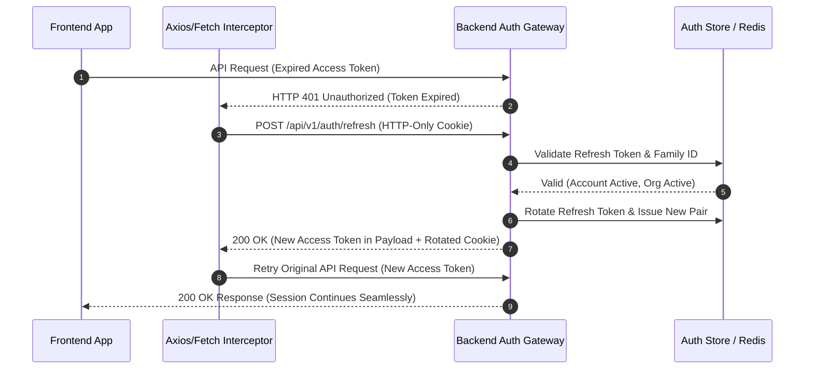
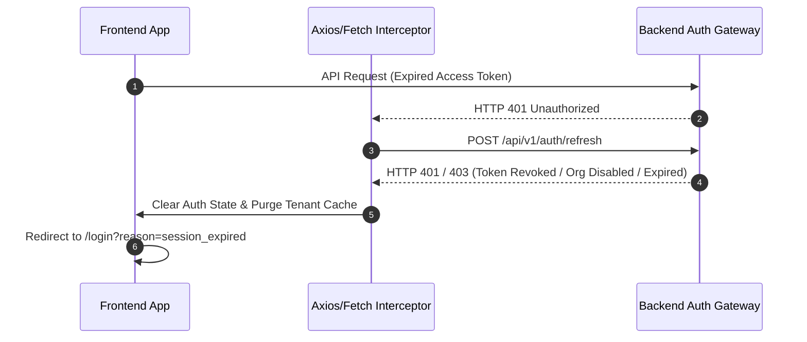

# NEXUSHR EMS — AUTHENTICATION & REFRESH-TOKEN SECURITY CONTRACT

**Document Version:** 1.0  
**Effective Date:** 2026-08-31  
**Scope:** Production Security Architecture, Token Lifecycle, Refresh-Token Protocol & Frontend Session Contract  
**Target Services:** Auth API (`/api/v1/auth/*`), Gateway Interceptors, Frontend Session Context  

---

## 1. EXECUTIVE OVERVIEW

This contract defines the authoritative authentication lifecycle, session refresh behavior, security boundaries, and concurrency handling for NexusHR EMS.

It establishes a strict protocol between the **Frontend Application** and the **Backend Auth Gateway** to handle token expiration, session continuation, security breaks, and token revocation without exposing sensitive credentials or introducing infinite loop vulnerabilities.

---

## 2. TOKEN LIFECYCLE & STORAGE SPECIFICATION

| Artifact | Lifetime | Storage Location | Security Scope | Responsibilities |
| :--- | :--- | :--- | :--- | :--- |
| **Access Token** | Short-lived (15 minutes) | In-Memory (React AuthContext state) | Bearer Header (`Authorization: Bearer <token>`) | Authorizes scoped API requests. Contains `userId`, `organizationId`, `role`, and `permissions`. |
| **Refresh Token** | Medium-lived (7 days) | HTTP-Only, Secure, SameSite=Strict Cookie | Restricted to `/api/v1/auth/refresh` & `/api/v1/auth/logout` | Rotates access tokens. Server-managed, revocable, tracked via Token Family ID. |
| **Session Cache** | Per Session | React Auth State + Secure Local Encrypted Cache | Tenant-Scoped (`user.organizationId`) | UI State, Permissions, User Profile. Cleared on logout/security break. |

> [!IMPORTANT]
> **Security Rule:** Access tokens must never be persisted in unencrypted `localStorage` or `sessionStorage`. Refresh tokens must be stored in HTTP-Only cookies to protect against Cross-Site Scripting (XSS) extraction.

---

## 3. REFRESH TOKEN SCENARIOS

### SCENARIO A: CONTINUE SESSION (Transparent Token Rotation)



#### Steps & Contract:
1. **Access Token Expiration**: API request returns `HTTP 401 Unauthorized` with error code `TOKEN_EXPIRED`.
2. **Single Refresh Trigger**: Frontend Auth Interceptor captures the 401 and issues a single `POST /api/v1/auth/refresh` request.
3. **Backend Validation**: Backend validates:
   - Refresh token signature and expiration.
   - User account status (`status === "Active"`).
   - Organization subscription status (`status === "Active"`).
   - Token family reuse status.
4. **Token Rotation (RTR)**: Backend invalidates old refresh token and issues a new access token + new refresh token cookie.
5. **Request Retry**: Interceptor updates in-memory access token and retries original request.
6. **User Experience**: User continues working uninterrupted without login redirection or data loss.

---

### SCENARIO B: BREAK SESSION (Security Enforcement & Logout)



#### Break Trigger Conditions:
- Refresh token expired (> 7 days).
- Refresh token explicitly revoked (Admin force-logout or password reset).
- User account suspended/disabled.
- Organization account suspended or disabled.
- **Token Reuse Detection Triggered** (Compromised token family).

#### Steps & Contract:
1. **Refresh Rejection**: Backend returns `401 Unauthorized` or `403 Forbidden`.
2. **State Purge**: Frontend immediately clears in-memory user state, active permissions, and tenant-bound cache.
3. **Navigation Redirect**: User is redirected to `/login` with an explicit toast: `"Your session has expired. Please log in again."`.

---

## 4. CONCURRENCY & REFRESH STORM PROTECTION

When a page loads multiple dynamic widgets simultaneously, multiple parallel API calls may fail with 401 at the exact same millisecond. To prevent a **Refresh Storm** (sending 10 parallel refresh calls and invalidating rotated tokens):

```typescript
// Canonical Frontend Interceptor Concurrency Strategy
let isRefreshing = false;
let failedQueue: Array<{
  resolve: (token: string) => void;
  reject: (error: any) => void;
}> = [];

function processQueue(error: any, token: string | null = null) {
  failedQueue.forEach((promise) => {
    if (error) {
      promise.reject(error);
    } else {
      promise.resolve(token!);
    }
  });
  failedQueue = [];
}

// Inside API Interceptor Response Error Handler:
if (error.response?.status === 401 && !originalRequest._retry) {
  if (originalRequest.url.includes("/auth/refresh")) {
    // REFRESH LOOP PROTECTION: Abort immediately if /auth/refresh fails
    isRefreshing = false;
    processQueue(error, null);
    authService.clearSessionAndRedirect();
    return Promise.reject(error);
  }

  originalRequest._retry = true;

  if (isRefreshing) {
    // Queue concurrent 401 requests until single refresh completes
    return new Promise((resolve, reject) => {
      failedQueue.push({ resolve, reject });
    }).then((token) => {
      originalRequest.headers["Authorization"] = `Bearer ${token}`;
      return apiClient(originalRequest);
    });
  }

  isRefreshing = true;

  return new Promise((resolve, reject) => {
    authService
      .refreshToken()
      .then((newToken) => {
        apiClient.defaults.headers.common["Authorization"] = `Bearer ${newToken}`;
        originalRequest.headers["Authorization"] = `Bearer ${newToken}`;
        processQueue(null, newToken);
        resolve(apiClient(originalRequest));
      })
      .catch((err) => {
        processQueue(err, null);
        authService.clearSessionAndRedirect();
        reject(err);
      })
      .finally(() => {
        isRefreshing = false;
      });
  });
}
```

---

## 5. REFRESH LOOP PROTECTION

To guarantee that a broken auth endpoint never causes an infinite retry loop:
1. **Endpoint Exemption**: Requests to `/api/v1/auth/refresh`, `/api/v1/auth/login`, and `/api/v1/auth/logout` MUST NEVER trigger a refresh interceptor.
2. **Single Attempt Limit**: `originalRequest._retry = true` flag enforces a maximum of ONE retry attempt per original request.
3. **Hard Failure Termination**: If `/api/v1/auth/refresh` returns non-200 status, `isRefreshing` is reset to `false`, the failed queue is cleared, and session termination is triggered immediately.

---

## 6. LOGOUT & SESSION REVOCATION

```
[User Clicks Logout]
        ↓
1. Frontend calls POST /api/v1/auth/logout (Backend revokes refresh token & invalidates session in Redis)
        ↓
2. Backend clears HTTP-Only refresh cookie
        ↓
3. Frontend clears in-memory state, permissions, and tenant storage
        ↓
4. User redirected to /login
```

> [!NOTE]
> Client-side token deletion alone is insufficient for production compliance. The backend MUST revoke the session ID in Redis/Database to invalidate any in-flight tokens.

---

## 7. AUDIT & SECURITY EVENTS

The backend authentication service MUST record immutable security audit logs for the following events:

| Event Code | Trigger Condition | Severity | Audit Payload |
| :--- | :--- | :--- | :--- |
| `AUTH_SESSION_REFRESHED` | Successful access token rotation | INFO | `userId`, `orgId`, `ip`, `userAgent`, `familyId` |
| `AUTH_REFRESH_FAILED` | Refresh token expired or invalid | WARNING | `userId`, `orgId`, `ip`, `reason` |
| `AUTH_TOKEN_REUSE_DETECTED` | Attempted use of revoked refresh token | CRITICAL | `userId`, `orgId`, `ip`, `familyId` (Triggers token family wipe) |
| `AUTH_SESSION_REVOKED` | Explicit user/admin logout or force logout | INFO | `userId`, `orgId`, `revokedBy` |

---

## 8. SUMMARY OF BACKEND RESPONSIBILITIES
- Server-side JWT signature verification using RSA256 / Ed25519.
- Redis-backed session tracking and revocation list.
- Enforcing tenant state checks on every refresh request.
- Automatic token family invalidation upon reuse detection.
